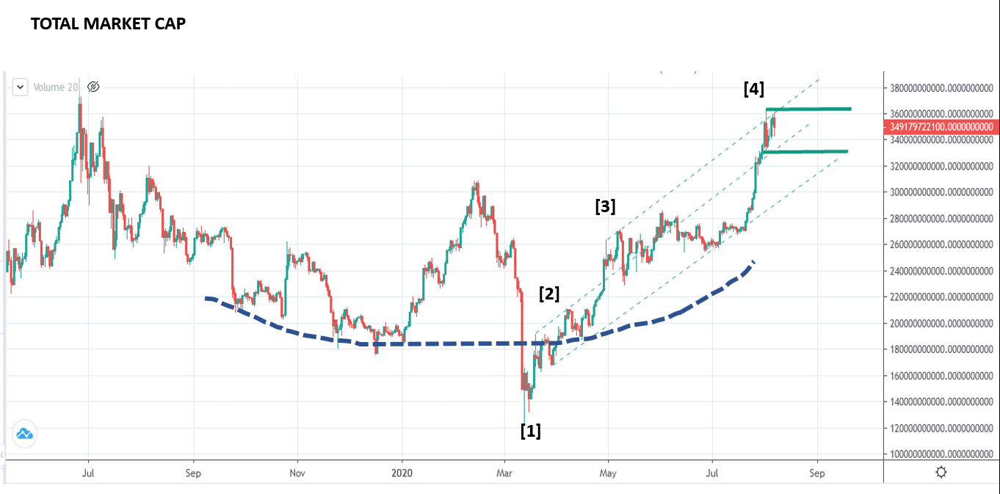
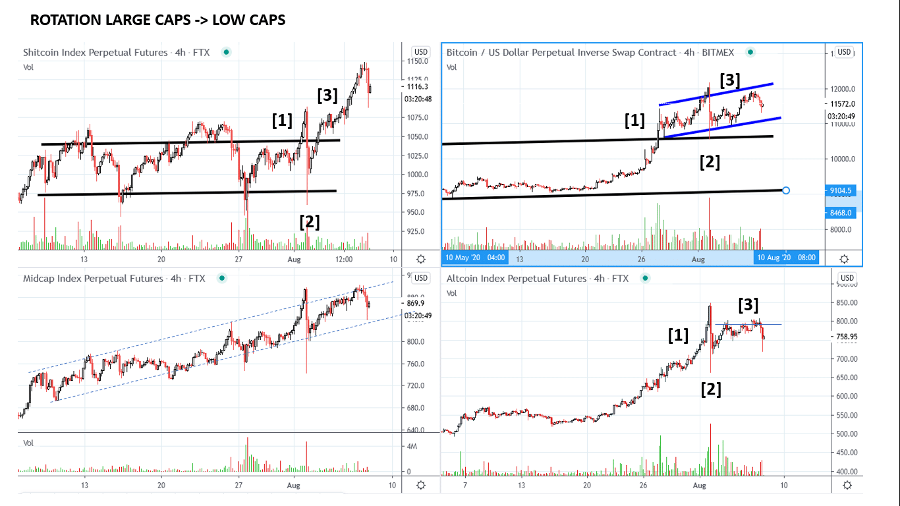
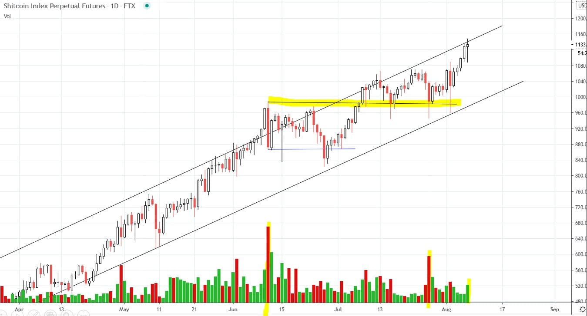
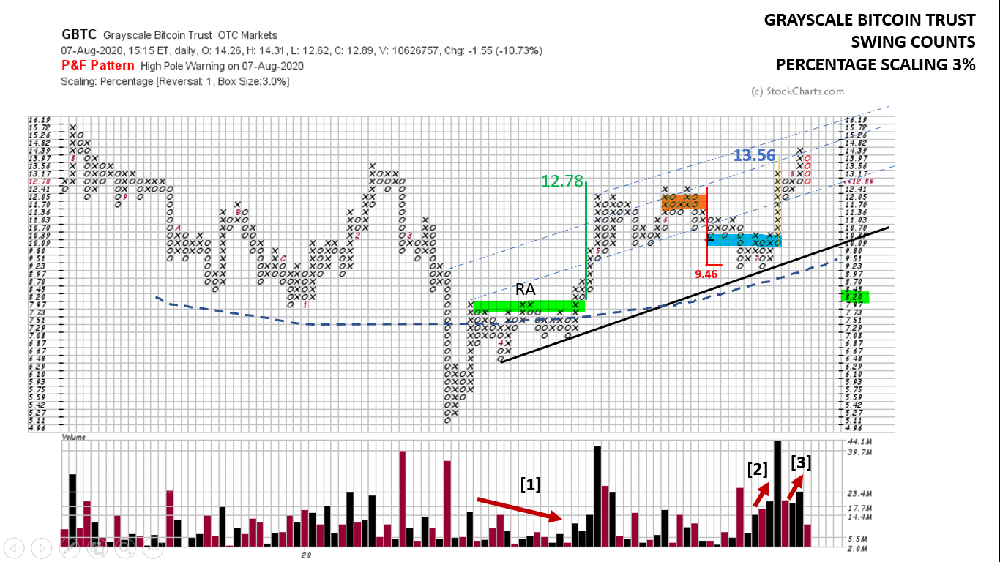

# Wyckoff Crypto Report vol 29

URL: https://www.wyckoffanalytics.com/wyckoff-crypto-report-vol-29/
Date: 2020-08-07T14:42:13
Author: Alessio Rutigliano

The WYCKOFF CRYPTO REPORT provides regular updates on the most popular digital assets based on the Wyckoff Methodology. Our market outlook follows the principles of Supply and Demand and Market Participants Analysis as they are taught and practiced in the WTC/WTPC/WMD classes.
### Crypto Market Cap Overview. Daily chart.

This is the Crypto Market Cap chart calculated by TradingView (Ticker: TOTAL ). In the second part of the rounding bottom formation we can clearly recognize the COVID reaction [1] , the quick recovery at point [2] that defines the stride of the trend (look at the reverse trendlines, blue dotted line). The consolidation on decreasing volatility and higher lows near the top of the capitulation bar [3] suggests continuation. The change of Behavior near the reverse trendline at point [4] suggests a period of consolidation. Usually when the market cap chart consolidates , we observe important rotation dynamics at work.
________________________________________________________________________________________
### Crypto Markets Outlook (4h)
###

As usual, the Futures offered by FTX provide us a much more detailed pitcture. After a period of outperformance of Bitcoin and Large Caps (Ethereum, Ripple, LiteCoin) [1], the reaction at point [2] not only indicates institutional profit taking on Bitcoin, but also suggests a potential rotation into small caps. The rotation is confirmed by the quick recovery at point [3] on the Sh*tPerp Index (low caps) .
Bitcoin is still consolidating, the Altcoin Index (Large Caps) is lagging. T he Small Cap index at the top is in an interesting structural position. Backing up action? Further testing is needed. The recent reaction does not show evidence of distribution yet. Volume is low and we have not broke significant demand levels. If the $1K level holds, we expect at least a retest of the high.
________________________
### Sh*tcoin Perpetual Index (Low Cap Index). Overbought or acceleration?
We are close to the oversold trendline of a long term uptrend, but very often LEADERSHIP ASSETS tends to overshoot the supply line and conclude the trend with a climactic move. The supply signature does not show distributional signs yet.

________________________________________________________________________________________
### GBTC (Grayscale Bitcoin Trust)
As usual, the Grayscale Bitcoin Trust offers an interesting alternative look at Bitcoin. The long term formation marked by the blue dashed line is very constructive and suggests a remarkable horizontal count. However, when we calculate the Horizontal count for laggards assets, we must be as conservative as possible. For this reason, it’s a good practice to focus on the recent price action. Here you can see a 3% scaling Point and Figure Chart. After the extreme oversold condition (the COVID shakeout in the middle of the chart) price quickly recovers and consolidates in the $6-8 range. Decreasing volume at point [1] suggests a bullish bias. For Swing trading purposes, the reaccumulation range highlighted in green generates a 15 box counts that gives a very accurate target for the intermediate top around $12.

The local distribution count highlighted in orange points to the oversold line of the uptrend: a very logical target.
High volume at point [2] on the oversold line of the trend channle suggests presence of demand. The area highlighted in blue gives us a confirmation count of the original target around $13.56.
We are now close to the overbought line of the big trend. at point 3 we see increasing effort to the upside, but less result. Supply is emerging, and the red column suggests further consolidation.
If price breaks the $12.8 level, we expect a comeback to the support of the trend (bearish scenario). If supply diminishes and price is unable to break this significant level, we can tactically extend the accumulation count highlighted in blue.
## Trading the Crypto Market with the Wyckoff Method
3 Session Course. $199. You can still listen to the recordings of all the sessions.
https://www.wyckoffanalytics.com/event/trading-the-crypto-market-with-the-wyckoff-method/

__________________________________________________________________________________________________
## Send us your question!
Register here for free or comment the report on our Twitter channel @WykoffAnalysis.
I will be happy to discuss your questions in the next Crypto Reports!
