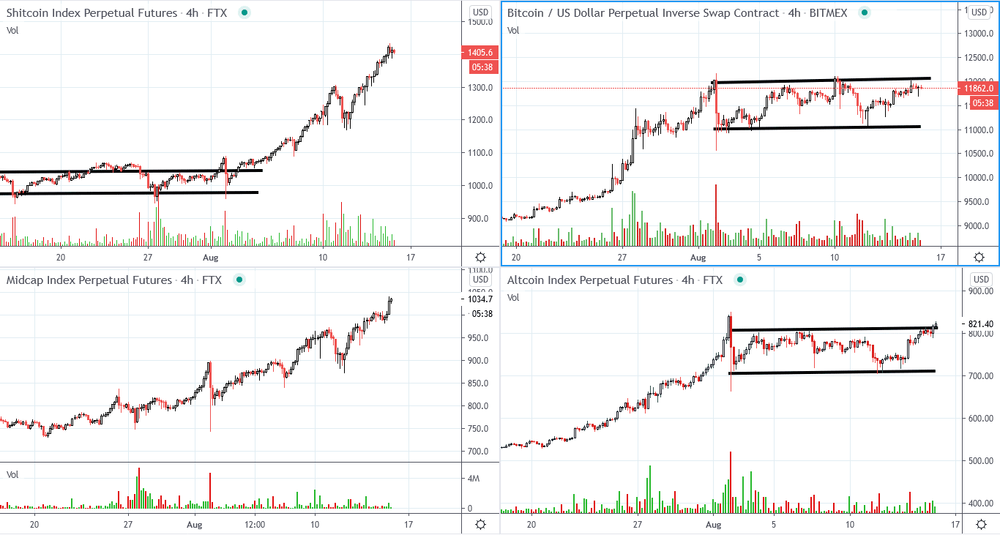
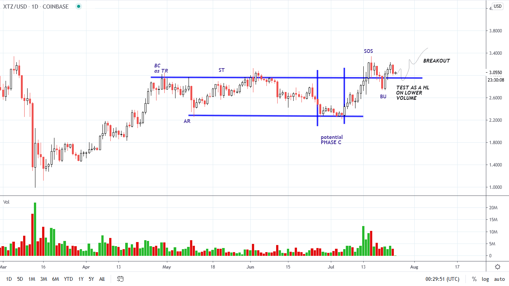
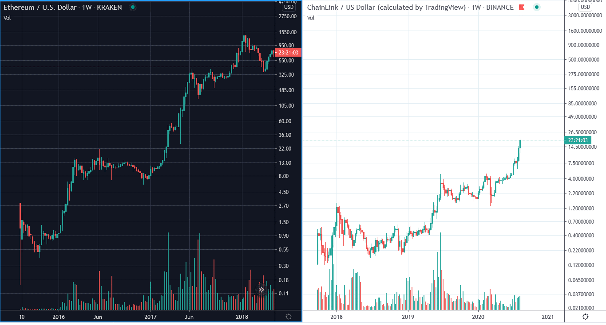
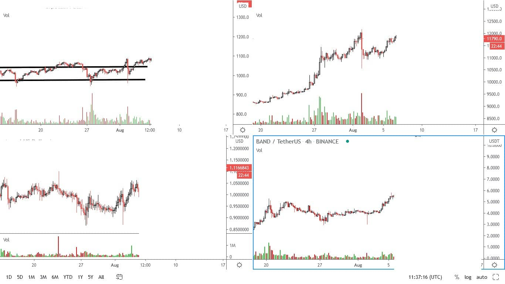
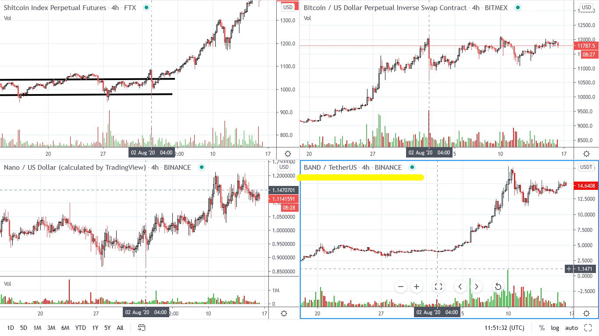

# Wyckoff Crypto Report vol 30

URL: https://www.wyckoffanalytics.com/wyckoff-crypto-report-vol-30/
Date: 2020-08-15T18:05:48
Author: Alessio Rutigliano

The WYCKOFF CRYPTO REPORT provides regular updates on the most popular digital assets based on the Wyckoff Methodology. Our market outlook follows the principles of Supply and Demand and Market Participants Analysis as they are taught and practiced in the WTC/WTPC/WMD classes.
### Flash update. Absorption still in play (4h)
###

The trens id still up. Buyers are accepting higher prices and whatever supply comes to market is quickly absorbed. Last week we have highlighted the outperformance of Small Caps and Mid caps compared to Bitcoin. The Small Caps (especially the DeFi sector) have leaded the rally. Bitcoin and the Major caps shows evident signs of absorption too near the resistance. Higher lows on decreasing volume and an overall decrease of volatility to the downside suggest continuation to the upside.
TACTICS:
Tight stop losses on ShitCoins/Small Caps.
CHAINLINK confirms its long term leadership.
ROTATION SCENARIO: Bitcoin and Big Caps are currently lagging. In the weekend however, we tend to see some profit taking in the small cap sector. If that happens, and Bitcoin outperforms, that would be an important clue of possible rotation back into Ethereum, Litecoin, Tezos, Bitcoin.
________________________
### Tezos (XTZ) Update.
Trading Setup published on 7/24 (Wyckoff Crypto Report vol. 28)

TODAY
Tezos has successfully completed the accumulation structure. The Setup shown in the previous Crypto Report has been successful. Tezos has committed above the February high and we are currently testing the supply available at this level. The reaction highghted in yellow on the chart has not distributional qualities. The supply signature is not extreme and XTZ is holding its gains. A retest of the low on decreased volume and volatility followed by continuation to the upside is the ideal point for adding to the position opened in early August. If the market does not experience corrections in the next week, the basorption can be aggressive.

___________
### ChainLink (LINK). 2017 Again?
In the July Class and in the previous Crypto Reports we have shown several Points of Entry for ChainLink. In the next weeks we will explore many mid caps and low caps too. Now let’s focus on the big structure. On the weekly chart, ChainLink is almost identical to Ethereum, the leadership coin of the 2017 bull run.

We will closely follow this formation in the next weeks, and we reveal our PnF counts.
______________
### Selection Exercise
The selection process is a very important step in your trading practice. The bias of the market is up. Which of the four assets would be your favourite candidate to the upside?

### Solution
Band is the best choice:
-it has the lowest volatility (supply is absorbed)
-it has the shallowest reaction (Spring no. 3)
-it’s in a good structural position (Spring) bs Bitcoin (CHoCH)
The Shitcoin Index is also a great candidate.

______________
## Trading the Crypto Market with the Wyckoff Method
3 Session Course. $199. You can still listen to the recordings of all the sessions.
https://www.wyckoffanalytics.com/event/trading-the-crypto-market-with-the-wyckoff-method/

__________________________________________________________________________________________________
## Send us your question!
Register here for free or comment the report on our Twitter channel @WykoffAnalysis.
I will be happy to discuss your questions in the next Crypto Reports!
