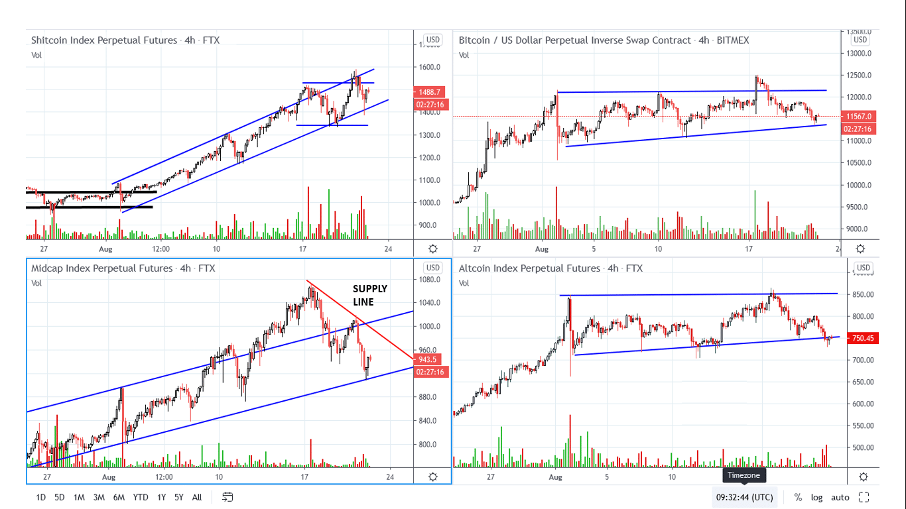
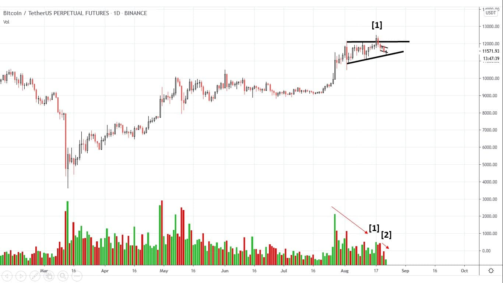
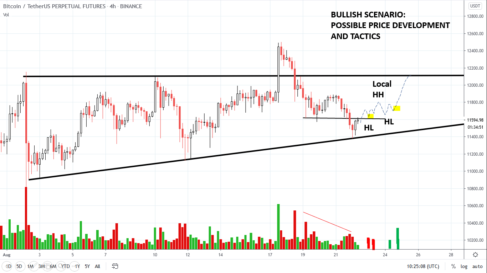
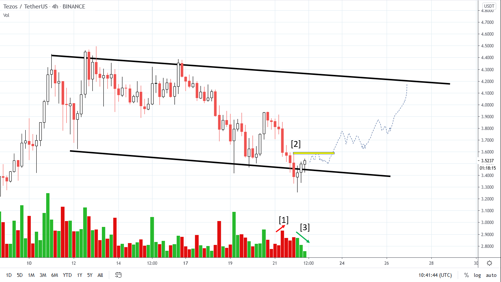
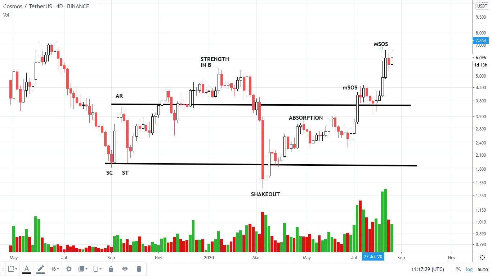
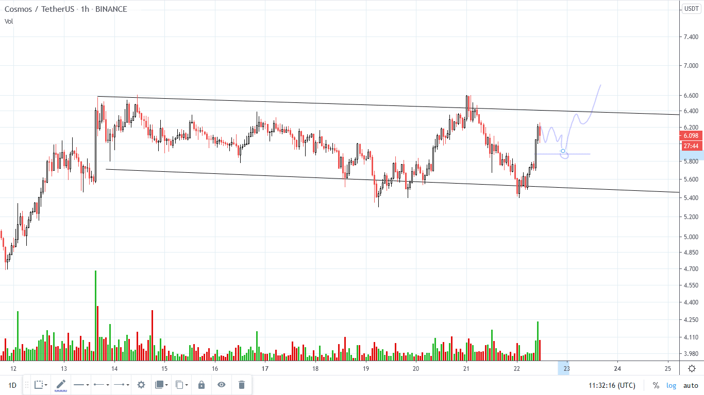

# Wyckoff Crypto Report vol 31

URL: https://www.wyckoffanalytics.com/wyckoff-crypto-report-vol-31/
Date: 2020-08-22T04:05:03
Author: Alessio Rutigliano

The WYCKOFF CRYPTO REPORT provides regular updates on the most popular digital assets based on the Wyckoff Methodology. Our market outlook follows the principles of Supply and Demand and Market Participants Analysis as they are taught and practiced in the WTC/WTPC/WMD classes.
### Market Overview (4hr)

###
In the last week we have seen profit taking in the leader indexes (SHITPERP low caps and MIDPERP mid caps), but the support of the uptrend has not been violated. Bitcoin and Large Cap coins have shown constrcutive behaviour in the last week: we do not have penetrated important supports yet. On the 4hr we can see some demand coming in on the last 4 bars, a spring setup is possible.
On the Midperp index, the supply line highlighted in red is a very important line to watch.
TACTICS: We want to see a good demand bar (up effort >, up result > ) followed by a retest of the low.
ROTATION SCENARIO: The Low caps Index is leading, but Bitcoin and Big Caps are holding their gains in a potential phase C of a larger accumulation structure. Keep an eye on both assets.
________________________
### Bitcoin Daily Picture

Volatility and volume are contracting on Bitcoin. At point [1] we see an uptrust action with a local increase of volume, but for now this selling has not produced any break of significant support levels. The supply signature at point [2] has decreased and we are still on the upsloping support of this consolidation.
### 4HR Bitcoin Bullish Scenario

In the Crypto Course we have discussed the importance of scenarios and tading tactics. Here is an example. Bitcoin is springing the local support. A local increase of volume (effort) has not produced a significant break to the downside (result). Look also the red line at the bottom of the chart: the overall supply signature is decreasing on the current downswing. Let’s visualize how price can behave in the next days. If supply has been really absorbed, we would like to see testing of the supply higher lows and decreased volume. This kind of formation usually evolves into a Minor Sign of Strength as a minor HH followed by a quick acceleration. The yellow area represents possible PoEs.
What’s the failure of the scenario? Send you charts on the forum, I’ll happy to analyze with you the bearish case.
___________________________________________________________________________
### Tezos (XTZ) 4hr

Same story on Tezos. Local increase of supply (down effort) at point [1] but low result. The top of the big downspread at point [2] is a very important confirmation level.
______________________________
### ATOM. Low caps. The big picture

Many low caps are currently in the same spot: we are completing a Major Sign of Strength. Usually, we want to see a backing up action. The high volume on the last upbars is very high, for this reason we can be more aggressive with our stop losses. However, the overall volume signature on this chart tell an important bullish story: market participants that were on the sidelines in 2019 are entering this market in a very aggressive way accepting higher and higher prices. Despite the high volume, the reactions are short and shallow. There is still room to attack and overshoot the ATH at $8.
On the intraday, a spring of the SOS bar would be nice point of entry for short term traders.

______________
## Trading the Crypto Market with the Wyckoff Method
3 Session Course. $199. You can still listen to the recordings of all the sessions.
https://www.wyckoffanalytics.com/event/trading-the-crypto-market-with-the-wyckoff-method/

__________________________________________________________________________________________________
## Send us your question!
Register here for free or comment the report on our Twitter channel @WyckoffAnalysis.
I will be happy to discuss your questions in the next Crypto Reports!
