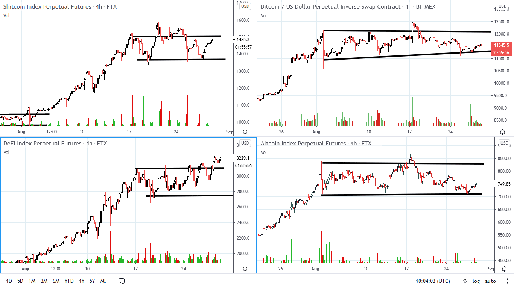
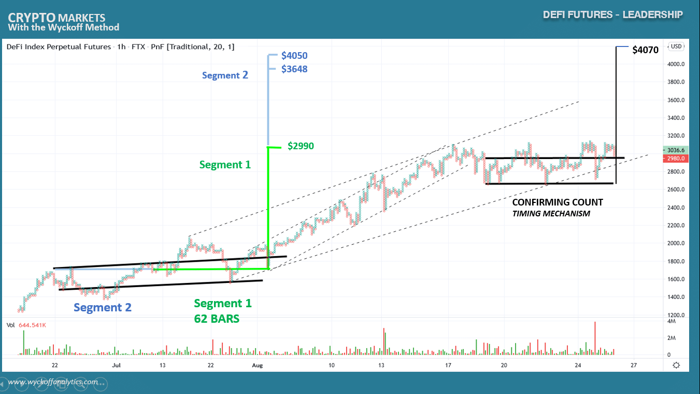
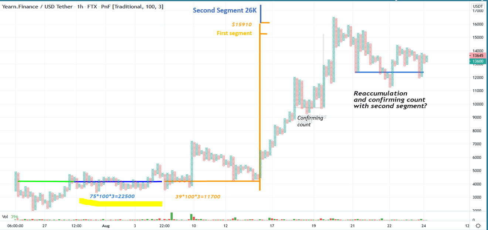
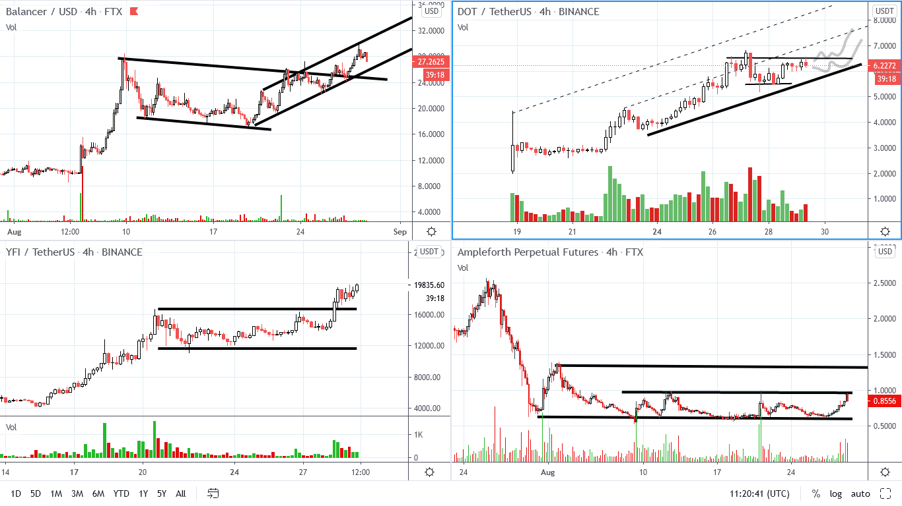

# Wyckoff Crypto Report vol 32

URL: https://www.wyckoffanalytics.com/wyckoff-crypto-report-vol-32/
Date: 2020-08-29T03:35:48
Author: Alessio Rutigliano

The WYCKOFF CRYPTO REPORT provides regular updates on the most popular digital assets based on the Wyckoff Methodology. Our market outlook follows the principles of Supply and Demand and Market Participants Analysis as they are taught and practiced in the WTC/WTPC/WMD classes.
### Market Overview (4hr)

The Leading Index DeFi PERP (thematic buying Decentralized Finance) is leading the market and is currently in a strong position. DEFIPERP has cleared the resistance (MSOS) and the current reaction has bullish characteristics (small downspread, no ability to commit to the downside). We look for long candidates in the DEFIPerp Index.
Bitcoin is in a spring position . We are currently testing the 11.6K level.
________________________
### The Leading Index – Decentralized Finance Index

Shayan, a student of the Crypto Class, has asked in July us to look at the DeFi Perp Index. Good idea! At that time, we were still in the range. A much bigger structure was completed in mid August. Now, we have fulfilledthe first target (PnF segment highlighted in green). We still have fuel in the tank for a move to $40000. The confirming count suggests that the timing of the continuation of the uptrend is now. The DeFi mania is not over for now, acceleration to the upside in synch with S&P and Nasdaq is very likely.
____________
The strange case of Yearn.Finance

Yearn.finance is the first asset to be pricier than Bitcoin. The DeFi concept in fact provide a “natural leverage effect” that we usually study in the relationship oil price-oil company stocks- oil service stocks.
Point and figure charts suggests that we have fulfilled only the first segment of the big accumulation structure. The current range presents all the attribute of a reaccumulation. The potential RA points to the $26K target, a great clue: a confirming count suggests that the timing is NOW.
________________
## DeFi assets. Balancer, PolkaDOT, YFI, AmpleForth

YFI is breaking up the consolidation. Good candidate for a trade to the long side.
DOT is structurally and comparatively strong. We have drawntwo possible bullish scenarios. Continuation to the uspide/acceleration is very likely.
Balancer is in an established uptrend. Look for the dips in the current channel.
AmpleForth is lagging, but we want to stay alert and look for signs of rotation.
______________
## Trading the Crypto Market with the Wyckoff Method
Investing and trading in the crypto space requires discipline and a systematic approach. The Wyckoff Method provides a logical framework for both long term investors and intraday traders.
In these three sessions, Alessio Rutigliano illustrates how to apply the techniques used by generations of stock and commodities traders to this new emerging asset class. The course covers multiple strategies for several types of traders, from long term investors that want to participate in this new market through conventional ETNs, to advanced crypto traders that want to take advantage of the high volatility and momentum of these instruments. The course include case studies from Bitcoin and Altcoin markets and exercises.
3 Session Course. $199
https://www.wyckoffanalytics.com/event/trading-the-crypto-market-with-the-wyckoff-method/

________________________________________________________________________________________
## Send us your question!
Register here for free or comment the report on our Twitter channel https://twitter.com/WyckoffAnalysis
I will be happy to discuss your questions in the next Crypto Reports!
