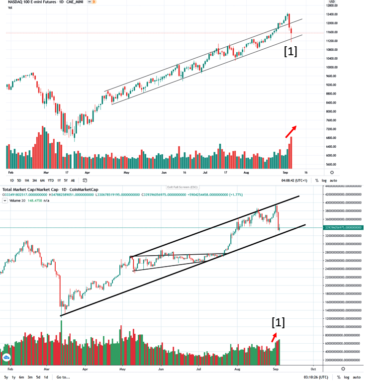

# Wyckoff Crypto Report vol 33

URL: https://www.wyckoffanalytics.com/wyckoff-crypto-report-vol-33/
Date: 2020-09-04T10:52:13
Author: Alessio Rutigliano

The WYCKOFF CRYPTO REPORT provides regular updates on the most popular digital assets based on the Wyckoff Methodology. Our market outlook follows the principles of Supply and Demand and Market Participants Analysis as they are taught and practiced in the WTC/WTPC/WMD classes.
### Wyckoff Crypto Discussion Episode 1
We are excited to launch a new series totally devoted to crypto-assets, the Wyckoff Crypto Discussion ! Join us each Thursday for a discussion of the cryptocurrency market from a Wyckoff perspective . Watch the first episode:
Submit your questions, we will be happy to discuss your charts!
### Nasdaq, Crypto Market Cap. Change of Behavior

On Thursday heavy selling has occurred in the stock market. The big down bar with high volume on the Nasdaq indicates synchronicity to the downside. The last down bar at point [1] , however, shows an increased effort to the downside and diminished result. The spread is slightly narrower and it closes in the upper half: some buying activity is evident on the oversold line of the uptrend. Selling has occurred in Crypto markets as well. The Crypto Market Cap shows a very similar picture: a big down bar has completely erased the gains of the last week. We are currently stopping on the oversold line of the uptrend.
We expect to see an attempt to retest the high of the last down bar. The quality of the rally will reveal if the current action can be classified as a potential shakeout or a Sign of Weakness.
We need more data to judge the long term picture. In this market context, short term strategies are very important. We have illustrated many examples of short term tactics in the Wyckoff Crypto Discussion .
### Your questions
Is there a difference in charting altcoins using USD pair or BTC pair when doing crypto Wyckoff analysis? I tend to find USD pair charts to be neater than BTC pairs, however if the majority of crypto trading is happening via BTC Whales then perhaps BTC pairs are better? thanks, Cryptegrity
The best approach is to start your analysis on the USD pair and then use the BTC pair only as a confirmation. Crypto funds generally look mainly at the dollar value of crypto assets. Even when only BTC pairs are available, Bitcoin is considered by speculators a “money of account”.
However, sometimes it’s possible to spot accumulation and distribution formations on BTC pairs too. How do we explain this phenomenon? We have explored this aspect in the course, but I’ll be happy to discuss it in our next Weekly Crypto Discussion on Thursday. Stay tuned!
______________
## Trading the Crypto Market with the Wyckoff Method
Investing and trading in the crypto space requires discipline and a systematic approach. The Wyckoff Method provides a logical framework for both long term investors and intraday traders.
In these three sessions, Alessio Rutigliano illustrates how to apply the techniques used by generations of stock and commodities traders to this new emerging asset class. The course covers multiple strategies for several types of traders, from long term investors that want to participate in this new market through conventional ETNs, to advanced crypto traders that want to take advantage of the high volatility and momentum of these instruments. The course includes case studies from Bitcoin and Altcoin markets and exercises.
3 Session Course. $199
https://www.wyckoffanalytics.com/event/trading-the-crypto-market-with-the-wyckoff-method/

________________________________________________________________________________________
## Send us your question!
Register here for free or comment the report on our Twitter channel https://twitter.com/WyckoffAnalysis
I will be happy to discuss your questions in the next Crypto Reports!
