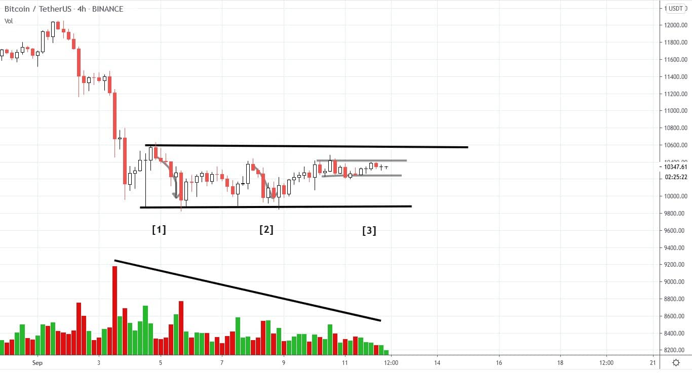
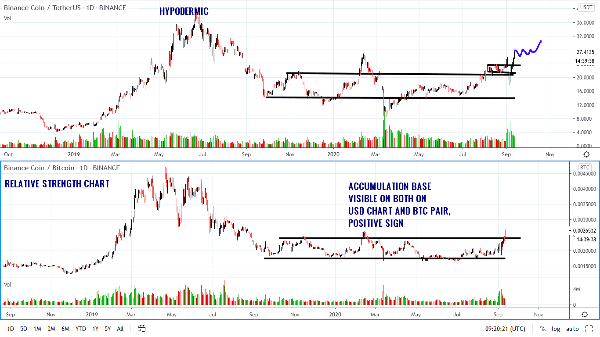

# Wyckoff Crypto Report vol 34

URL: https://www.wyckoffanalytics.com/wyckoff-crypto-report-vol-34/
Date: 2020-09-11T09:22:19
Author: Alessio Rutigliano

The WYCKOFF CRYPTO REPORT provides regular updates on the most popular digital assets based on the Wyckoff Methodology. Our market outlook follows the principles of Supply and Demand and Market Participants Analysis as they are taught and practiced in the WTC/WTPC/WMD classes.
### Wyckoff Crypto Discussion Episode 2
We are excited to launch a new video series totally devoted to crypto-assets, the Wyckoff Crypto Discussion ! Join us each Thursday for a discussion of the cryptocurrency market from a Wyckoff perspective . Watch the second episode:
Submit your questions, we will be happy to discuss your charts!
###
### Bitcoin 4hr flash update after Thursday’s WCD

Decreasing volume suggests that supply is exhausted, at least temporarily . Look at at points [1], [2] , and [3] . Each reaction has less and less volatility. The third reaction is currently flat and resides in the top half of the range. We are still in the trading range, and demand has to show itself . We want to see a break of the resistance followed by a shallow backup before considering a long entry. Keep in mind that in the bullish scenario, the backup would be extremely shallow in this specific case, since volatility is very low.
TACTICS
The flat reaction/trading range highlighted at point [3] is a principle in the principle. If the price fails to commit above the local resistance, we will look for a retest of the low.
Watch the video for the analysis of the whole crypto market!
### Binance Coin 1D – Bar chart and Relative strength compared vs BTC
Exchange tokens, in particular Binance Coin $BNB, are showing strength during this current correction. This is probably due to the fact that many established players in the Crypto space will step in into the Defi sector. Let’s look at the chart: BNB is showing strength in the last creation. The accumulation base is visible on the BNBBTC chart too. We have discussed this principle in the Wyckoff Crypto Course in July. In the next Wyckoff Crypto Discussions , we will discuss the potential of BNB and other Exchange Tokens.

______________
## Trading the Crypto Market with the Wyckoff Method
Investing and trading in the crypto space requires discipline and a systematic approach. The Wyckoff Method provides a logical framework for both long term investors and intraday traders.
In these three sessions, Alessio Rutigliano illustrates how to apply the techniques used by generations of stock and commodities traders to this new emerging asset class. The course covers multiple strategies for several types of traders, from long term investors that want to participate in this new market through conventional ETNs to advanced crypto traders that want to take advantage of the high volatility and momentum of these instruments. The course includes case studies from Bitcoin and Altcoin markets and exercises.
https://www.wyckoffanalytics.com/event/trading-the-crypto-market-with-the-wyckoff-method/

________________________________________________________________________________________
## Send us your question!
Register here for free or comment the report on our Twitter channel https://twitter.com/WyckoffAnalysis
I will be happy to discuss your questions in the next Crypto Reports!
