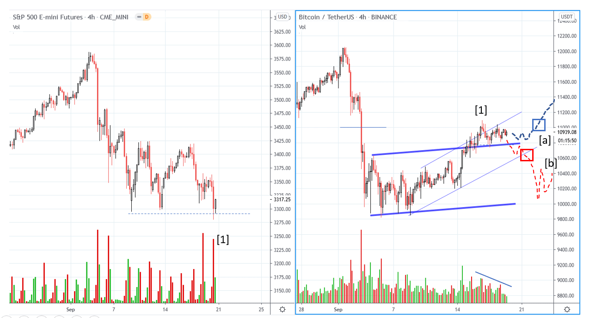
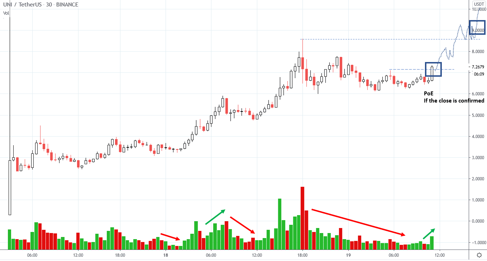
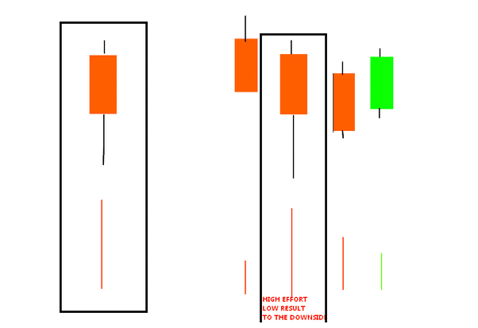

# Wyckoff Crypto Report vol 35

URL: https://www.wyckoffanalytics.com/wyckoff-crypto-report-vol-35/
Date: 2020-09-18T11:41:20
Author: Alessio Rutigliano

The WYCKOFF CRYPTO REPORT provides regular updates on the most popular digital assets based on the Wyckoff Methodology. Our market outlook follows the principles of Supply and Demand and Market Participants Analysis as they are taught and practiced in the WTC/WTPC/WMD classes.
### Wyckoff Crypto Discussion Episode 3
We are excited to launch a new video series totally devoted to crypto-assets, the Wyckoff Crypto Discussion ! Join us each Thursday for a discussion of the cryptocurrency market from a Wyckoff perspective . Watch the third episode:
Submit your questions, we will be happy to discuss your charts!
###
### Bitcoin 4hr flash update after Thursday’s WCD
The situation has not changed since Thursday’s Wyckoff Discussion. Volume on the S&P indicates an increase of buyers, but there is no lift for now. We are still in the REACTIONARY mode. The next week will be very important. Bitcoin is showing some structural strength, but the supply that emerged at point [1] has to be tested. We are near the halfway point of the original selling zone: it’s very common to see upthrusts in this area! For this reason, we want to act o nly after the confirmation . The blue and red dotted lines show two scenarios, bullish and bearish, and the Points of Entry (blue and red boxes).

________________
### UNI (UNISWAP)
UNISWAP has been just listed on Binance and shows a lot of momentum . Intraday traders can trade instruments like this like IPO: short term tactics, trade the momentum. Here is an example of a possible setup. First target $9. If it breaks the resistance, $13 is possible.

______________
Q & A
Q: What I don’t like on the volume indicator is that one only sees the ‘value’, and not how it was divided, how much used for the price up and down. (for instance, 5 small trades going up and one big going down to where it went up, a total volume of 6)
A: Buyers and sellers are present on each bar. On a very simplistic basis, supply is dominant on a down bar, demand is dominant on an up bar. However, single bars are like the letters of a word in a sentence or the notes of a melody. A single letter or a single note does not have a meaning. It’s only when you listen to that note in the context of a melody, that note acquires a real meaning. Your brain instantly analyzes the relationships between that note and the other notes that form the whole melody.
In the same way, when we study demand and supply, tape readers analyze the “relationships” between the bars. Our parameters are the spread of the bar, the position of the close, the volume. Look at the example below. On the left-hand side of the chart we see a big down bar on high volume. Looking at this single bar, we can say that sellers and buyers were very active, and sellers were dominant. However, it’s only when we put this bar in the context (right-hand side of the picture below) that we extract the information. In this case, volume increases on the second bar (effort to the downside increases) but the result to the downside is poor. There is a hidden force on that bar that limits the price to go down more. Buyers were active on that bar. The next two bars confirms our suspect.

Q: Another aspect of volume, there is so much fake volume. […] How reliable is volume on cryptocurrencies (you can answer this, if you have experienced that the volume matches with what is to be expected being reflected in the change of the price).
A: At WyckoffAnalytics volume analysis is our specialty . Many years ago, volume data was not very reliable, especially on small exchanges. However, today the major exchanges like Binance, Coinbase, Kraken, FTX, Bitstamp, Bitmex have reliable data. Most of the price discovery takes place on these major platforms. Small exchanges are not very important in the price discovery process. Big exchanges are not used by retail traders only: crypto funds and small institutions operate on these platforms too. BitWise Asset Management. It’s their interest to provide good and reliable data in order to attract institutional clients.
Ps. A good trick is to monitor volume data is looking at Messari.com. Their free charting platform aggregates the best volume data form several exchanges.
## Trading the Crypto Market with the Wyckoff Method
Investing and trading in the crypto space requires discipline and a systematic approach. The Wyckoff Method provides a logical framework for both long term investors and intraday traders.
In these three sessions, Alessio Rutigliano illustrates how to apply the techniques used by generations of stock and commodities traders to this new emerging asset class. The course covers multiple strategies for several types of traders, from long term investors that want to participate in this new market through conventional ETNs to advanced crypto traders that want to take advantage of the high volatility and momentum of these instruments. The course includes case studies from Bitcoin and Altcoin markets and exercises.
https://www.wyckoffanalytics.com/event/trading-the-crypto-market-with-the-wyckoff-method/

________________________________________________________________________________________
## Send us your question!
Register here for free or comment the report on our Twitter channel https://twitter.com/WyckoffAnalysis
I will be happy to discuss your questions in the next Crypto Reports!
