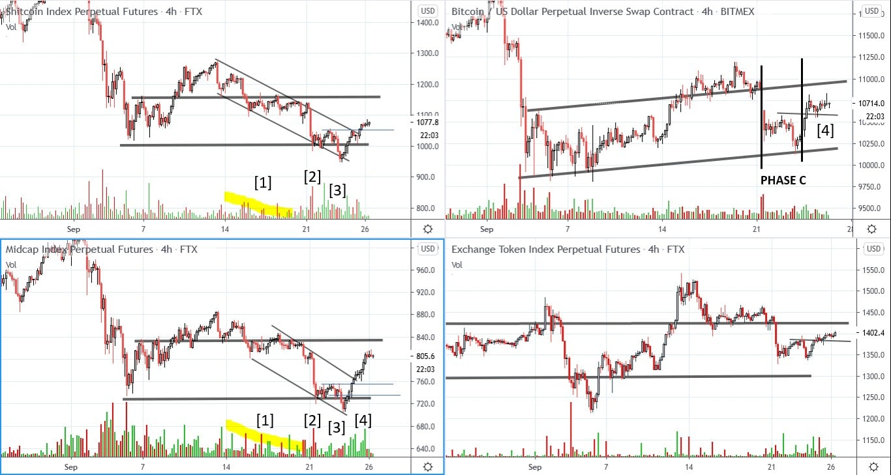

# Wyckoff Crypto Report vol 36

URL: https://www.wyckoffanalytics.com/wyckoff-crypto-report-vol-36/
Date: 2020-09-25T08:53:44
Author: Alessio Rutigliano

The WYCKOFF CRYPTO REPORT provides regular updates on the most popular digital assets based on the Wyckoff Methodology. Our market outlook follows the principles of Supply and Demand and Market Participants Analysis as they are taught and practiced in the WTC/WTPC/WMD classes.
### Wyckoff Crypto Discussion Episode 4
We are excited to launch a new video series totally devoted to crypto-assets, the Wyckoff Crypto Discussion ! Join us each Thursday for a discussion of the cryptocurrency market from a Wyckoff perspective . Watch the fourth episode:
If you have any questions, leave a comment below, we will be happy to discuss your charts!
### Quick update after Thursday’s session

After a reaction with decreasing supply signature on both Low Caps (SHITPERP) and Midcaps (MIDPERP) [1] , demand came in on the horizontal support [2] . The spring at point [2] has been confirmed by a test as a Lower Low [3] on decreasing volume, confirmed by a breakout. Bitcoin and the Exchange Index (BNBUSD, OKB, etc..) show comparative strength.
The overall picture is very constructive . We are currently residing above the previous resistance and at least short term the bias is still to the upside. If buyers are able to maintain this level, we expect to see a continuation of the rally at least to the top of the range ($11200 for Bitcoin).
### Rotation
Generally, when global markets switch from risk-on to risk-off mode, institutions working in the crypto space usually stay in Tether and Bitcoin. If the rally continues, we want to see capitals flowing from Bitcoin to MidCaps and Low Caps too . That rotation would suggest a much more sustainable trend . The good rally that we had on the MidCaps index this week is an early bullish sign.
## Trading the Crypto Market with the Wyckoff Method
Investing and trading in the crypto space requires discipline and a systematic approach. The Wyckoff Method provides a logical framework for both long term investors and intraday traders.
In these three sessions, Alessio Rutigliano illustrates how to apply the techniques used by generations of stock and commodities traders to this new emerging asset class. The course covers multiple strategies for several types of traders, from long term investors that want to participate in this new market through conventional ETNs to advanced crypto traders that want to take advantage of the high volatility and momentum of these instruments. The course includes case studies from Bitcoin and Altcoin markets and exercises.
https://www.wyckoffanalytics.com/event/trading-the-crypto-market-with-the-wyckoff-method/

________________________________________________________________________________________
## Send us your question!
Register here for free or comment the report on our Twitter channel https://twitter.com/WyckoffAnalysis
I will be happy to discuss your questions in the next Crypto Reports!
