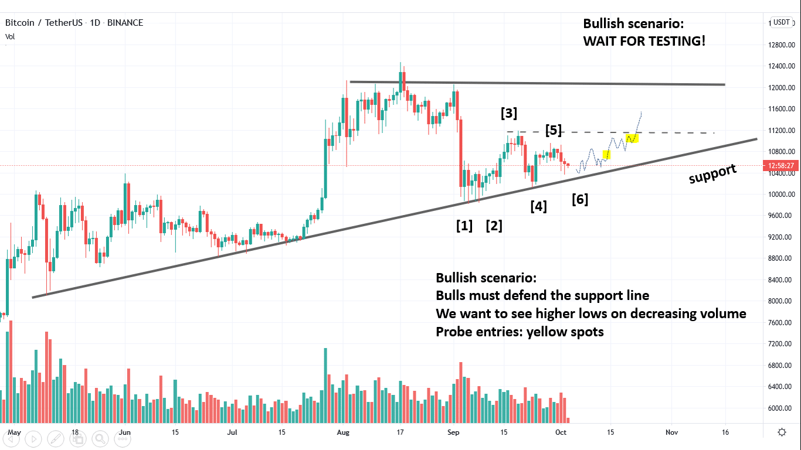
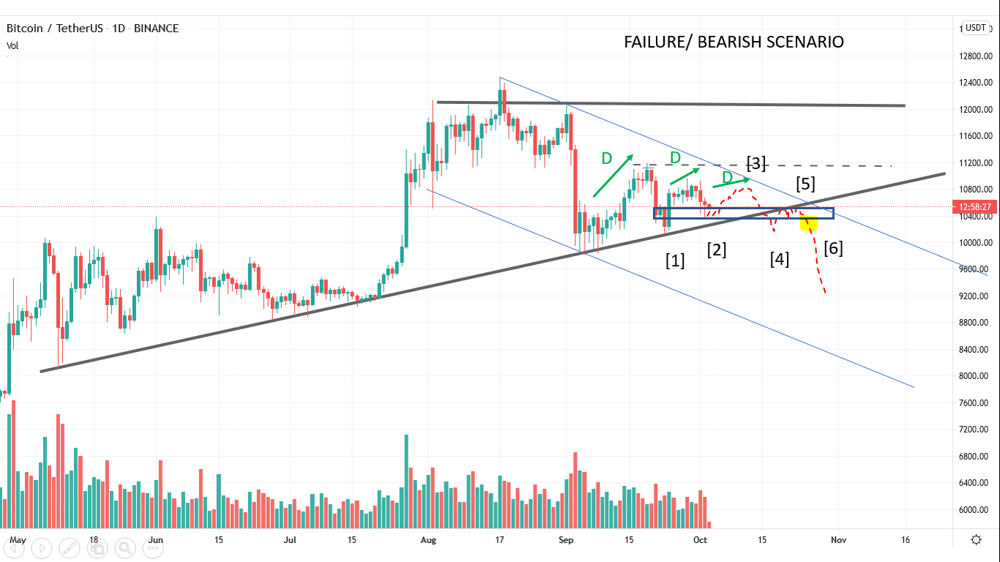
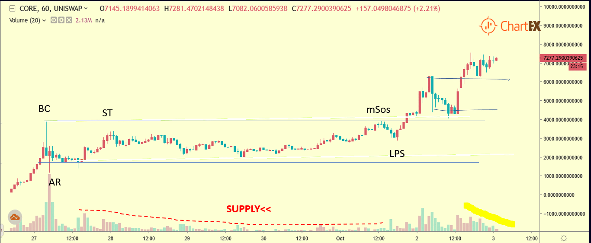

# Wyckoff Crypto Report vol 37

URL: https://www.wyckoffanalytics.com/wyckoff-crypto-report-vol-37/
Date: 2020-10-02T11:58:23
Author: Alessio Rutigliano

The WYCKOFF CRYPTO REPORT provides regular updates on the most popular digital assets based on the Wyckoff Methodology. Our market outlook follows the principles of Supply and Demand and Market Participants Analysis as they are taught and practiced in the WTC/WTPC/WMD classes.
### Wyckoff Crypto Discussion Episode 5
We are excited to launch a new video series totally devoted to crypto-assets, the Wyckoff Crypto Discussion ! Join us each Thursday for a discussion of the cryptocurrency market from a Wyckoff perspective . Watch the fifth episode:
If you have any questions, leave a comment below the video, we will be happy to discuss your charts!
### Quick update after Thursday’s session – Two scenarios
Demand is still present at the upsloping support, BUT THIS IS A HIGH-RISK POINT. It’s important to have both bullish and bearish scenarios in mind.
STRATEGY: WAIT FOR TESTS AND CONFIRMATIONS. A series of higher lows on decreasing volume would very encouraging. Probe entries on yellow spots. Final confirmation: dotted line.
BULLISH SCENARIO

Bitcoin is strictly correlated to the market. The market has shown demand and potential to retest the high , but bearish news could negatively impact the S&P in the next week , so we want to be prepared for the alternative scenario:
BEARISH SCENARIOS

We are currently springing the demand zone at point 2. If this spring fails to create a higher high, break the support at point 4 (the break can be minimal and have average volume), the whole picture could turn to bearish. In this scenario, the price could break to the downside very quickly if not supported by quality demand.
### COREUSD (UNISWAP)

CORE is one of the few assets that are showing strength this week. We have just completed a big reaccumulation on the intraday. supply is very low and suggests continuation to the upside.
## Trading the Crypto Market with the Wyckoff Method
Investing and trading in the crypto space requires discipline and a systematic approach. The Wyckoff Method provides a logical framework for both long term investors and intraday traders.
In these three sessions, Alessio Rutigliano illustrates how to apply the techniques used by generations of stock and commodities traders to this new emerging asset class. The course covers multiple strategies for several types of traders, from long term investors that want to participate in this new market through conventional ETNs to advanced crypto traders that want to take advantage of the high volatility and momentum of these instruments. The course includes case studies from Bitcoin and Altcoin markets and exercises.
https://www.wyckoffanalytics.com/event/trading-the-crypto-market-with-the-wyckoff-method/

________________________________________________________________________________________
## Send us your question!
Register here for free or comment the report on our Twitter channel https://twitter.com/WyckoffAnalysis
I will be happy to discuss your questions in the next Crypto Reports!
