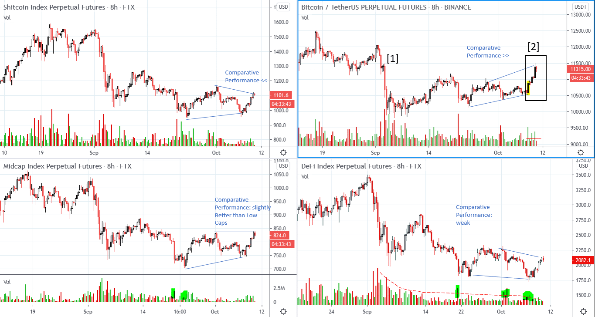
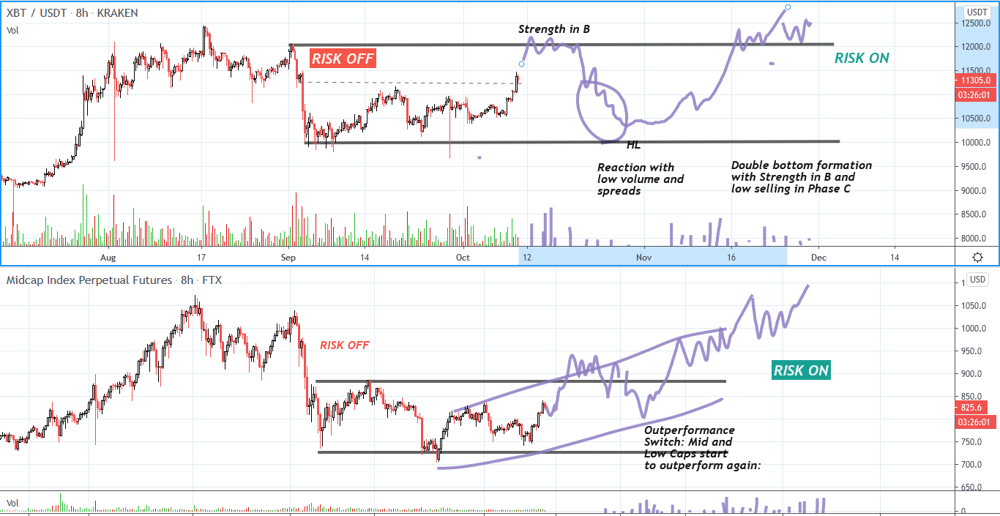

# Wyckoff Crypto Report vol 38

URL: https://www.wyckoffanalytics.com/wyckoff-crypto-report-vol-38/
Date: 2020-10-09T09:32:18
Author: Alessio Rutigliano

The WYCKOFF CRYPTO REPORT provides regular updates on the most popular digital assets based on the Wyckoff Methodology. Our market outlook follows the principles of Supply and Demand and Market Participants Analysis as they are taught and practiced in the WTC/WTPC/WMD classes.
### Wyckoff Crypto Discussion Episode 6
We are excited to launch a new video series totally devoted to crypto-assets, the Wyckoff Crypto Discussion ! Join us each Thursday for a discussion of the cryptocurrency market from a Wyckoff perspective . Watch the fifth episode:
If you have any questions, leave a comment below the video, we will be happy to discuss your charts!
### Quick update after Thursday’s session
Bitcoin has continued to rally after our Discussion. The supply signature is still low, and the down bars in the black square [2] are very small and have low volume. Buyers are absorbing the supply on the way up. Price has reached the top of the capitulation bar [1] , a very important supply level. In the best scenario, the price could continue to the $12K level with good up spreads and flat, low volume reactions.
COMPARATIVE PERFORMANCE AND ROTATION
Bitcoin is still outperforming mid and low caps.
Mid-caps are starting to show slightly better performance compared to Low Caps and Defi Assets. This is an encouraging clue.
We want to see institutions coming in and buying mid and low caps too, but the overall bottoming process could still last several weeks. The Defi index has a very low supply signature and each reaction has less volatility. We expect to see a technical rally.

Are we out of the woods? A scenario for advanced Wyckoffians
Markets always teach you to be PATIENT . We could still be in phase B of a bigger formation. Do not be lazy. Train your mind to imagine multiple scenarios. For example, this is just a case study where we see a gradual transition from Risk-off to Risk on mode . Bitcoin outperforms in the first half of the formation (Risk-Off Mode) and then underperforms in the second half, where institutions enter more speculative assets. Remember: the final structure is always influenced by the price action of the S&P.

