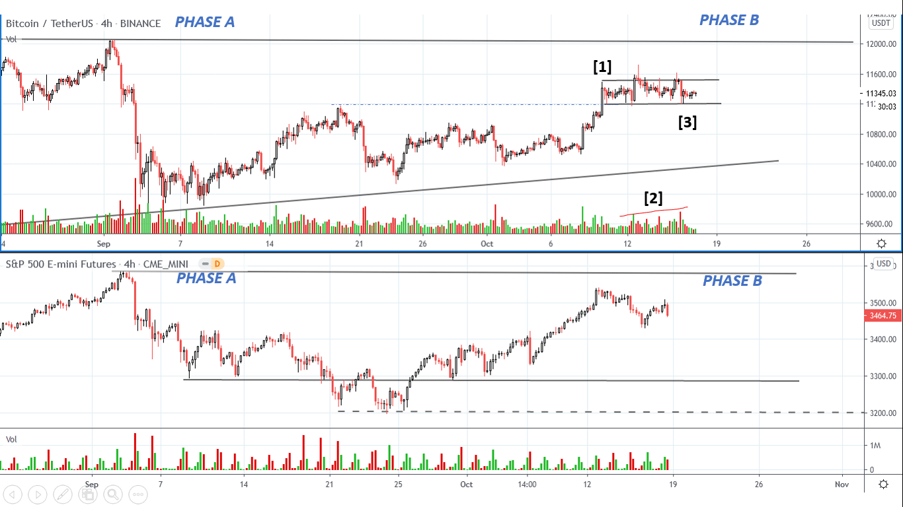
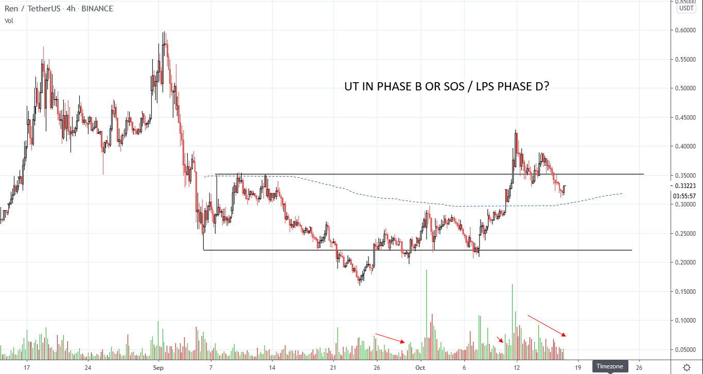

# Wyckoff Crypto Report vol 39

URL: https://www.wyckoffanalytics.com/wyckoff-crypto-report-vol-39/
Date: 2020-10-16T11:36:22
Author: Alessio Rutigliano

The WYCKOFF CRYPTO REPORT provides regular updates on the most popular digital assets based on the Wyckoff Methodology. Our market outlook follows the principles of Supply and Demand and Market Participants Analysis as they are taught and practiced in the WTC/WTPC/WMD classes.
### Wyckoff Crypto Discussion Episode 7
### Quick update after Thursday’s session
We are still residing in a mini-trading range above the previous high [1] . This is what Prof. Henry O’Pruden used to call “a principle within the principle”. Let’ study the supply signature in this mini-range. Look at the red volume bars: supply is locally increasing [2] , but the effort to the downside has not produced a significant result yet: the support at point [3] is still holding and now the volume is decreasing.

STRATEGY
We are in phase B on both Bitcoin and the S&P. Phase B is usually marked by increasing volatility in both directions . In other words, whipsaws are very common in this phase, and intraday traders should use tight stop losses and focus on key levels.
On the intraday, the most important price level is the $11390 resistance (BINANCE)
SCENARIO 1) Higher highs on decreasing volume followed by a close of the $11390 level would suggest a retest of the $11500 level first, and then an attempt to retest the $12K resistance.
FAILURE ) If the price fails to commit above the level of $11390, bulls will be in trouble. In this case, the whole swing from
WHAT’S NEXT FOR REN?
REN has led the market throughout the 2020 bull run. We have discussed the long term structure of REN in a special webinar conducted by our friends Kyle Stagoll @DaxxTrader and Trader Troy @tradertroy888 , talented traders and educators. It has been a pleasure to discuss with Kyle and Troy one of my favorite topics: Point and Figure charting applied to cryptos.
In the last two weeks, REN (Republic Protocol) has shown signs of local outperformance. We want to pay attention to any signs of institutional participation in this asset. The bottoming process could still require some time, and we always must synchronize our decisions with the context of the S&P. The next two weeks will be telltale. We will discuss this chart in the next episodes of our free Wyckoff Crypto Discussion on youtube. Stay tuned!

