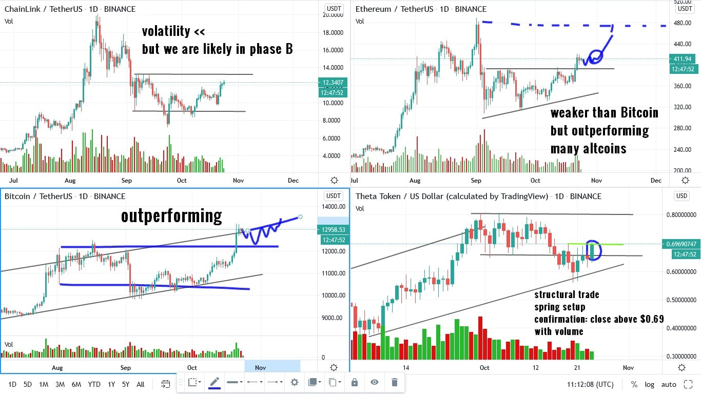
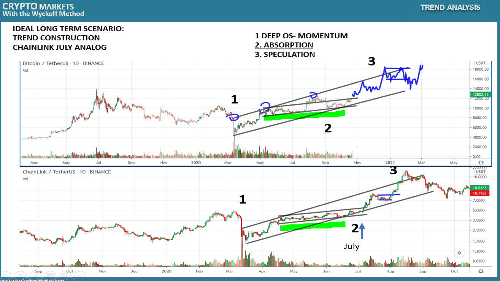

# Wyckoff Crypto Report vol 40

URL: https://www.wyckoffanalytics.com/wyckoff-crypto-report-vol-40/
Date: 2020-10-23T11:47:53
Author: Alessio Rutigliano

The WYCKOFF CRYPTO REPORT provides regular updates on the most popular digital assets based on the Wyckoff Methodology. Our market outlook follows the principles of Supply and Demand and Market Participants Analysis as they are taught and practiced in the WTC/WTPC/WMD classes.
### Wyckoff Crypto Discussion Episode 8
### Quick update after Thursday’s session
Bitcoin continues to lead the market. We still do not see signs of rotation . Big caps like Ethereum are performing better than small caps.
BACKGROUND: The S&P is showing signs of absorption but in the next two weeks the market will be subjected to the news cycle (stimulus and US presidential election) . The outlook is still bullish, and there is no evidence of supply, but traders should keep in mind that bearish news could potentially cause some temporary weakness (shakeout). Short term traders must monitor the price action on the intraday to catch a possible Change of Behavior in real-time. Advanced traders can tactically place bids under the support.
BITCOIN: The outperformance continues. We are close to the overbought line, but we do not see supply for now. If the local resistance turns into support, we will likely see an acceleration to the upside. If Bitcoin fails here, it will important to watch how big and small caps will perform during the reaction. Will capital rotates to other assets?
ETHEREUM: Price has committed above the local resistance, suggesting a retest of the high . Ethereum is weaker than Bitcoin but it is currently outperforming many altcoins.
CHAINLINK: Volatility has contracted, and we are retesting the resistance. We are still in Phase B of a larger consolidation. It will be important to see how much supply is still present at the resistance. ChainLink is currently underperforming Bitcoin.
THETA: Theta is in the spring position. A structural trade is available here. Close above $0.69 level with some volume increase, SL below the spring low.

### Chart of the Week. Bitcoin-Chainlink Analog
In the Wyckoff Trading Course, Roman discusses the three stages of an uptrend. The price action of Chainlink in July is a perfect case study. Here we see a classic case study: initial momentum after extreme oversold condition [1] , absorption [2], and speculation [3] . Bitcoin is currently in the second stage: higher highs and higher lows on low volume suggest that speculators have not joined the trend yet. If the analog will work, we can expect an acceleration in the third stage of the uptrend. We have explored this case study in our Wyckoff Crypto Discussion, watch the full episode!

