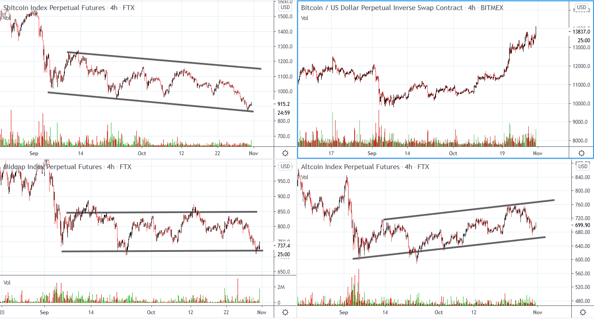
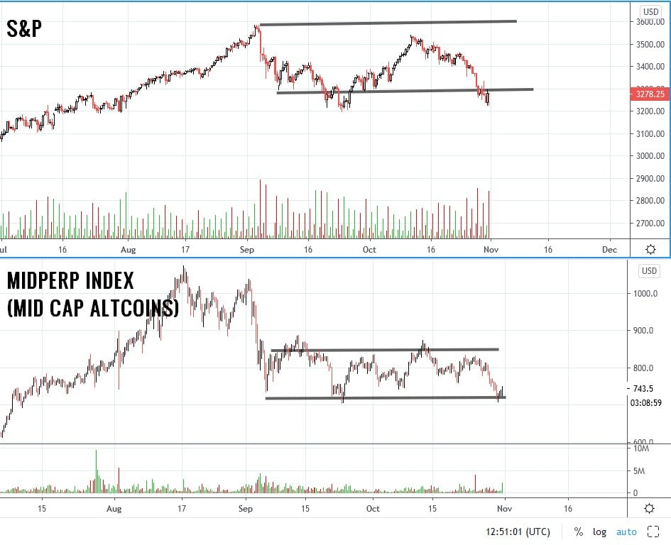
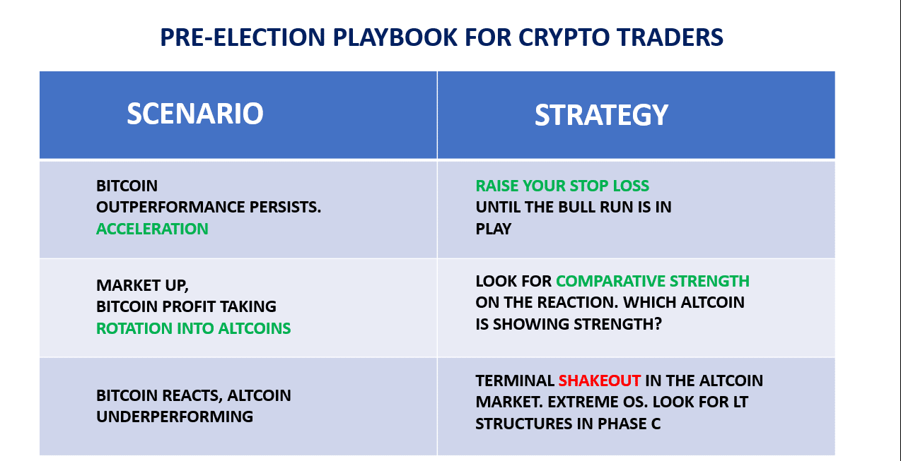
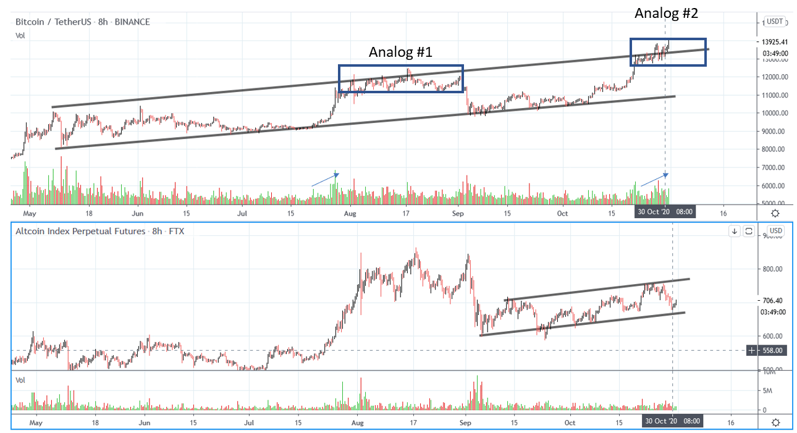

# Wyckoff Crypto Report vol 41

URL: https://www.wyckoffanalytics.com/wyckoff-crypto-report-vol-41/
Date: 2020-10-30T11:26:07
Author: Alessio Rutigliano

The WYCKOFF CRYPTO REPORT provides regular updates on the most popular digital assets based on the Wyckoff Methodology. Our market outlook follows the principles of Supply and Demand and Market Participants Analysis as they are taught and practiced in the WTC/WTPC/WMD classes.
### Wyckoff Crypto Discussion Episode 9
We are excited to launch a new video series totally devoted to crypto-assets, the Wyckoff Crypto Discussion ! Join us each Thursday for a discussion of the cryptocurrency market from a Wyckoff perspective . Watch the second episode:
Submit your questions, we will be happy to discuss your charts!
###
### Flash update after Thursday’s WCD

Bitcoin is still outperforming the market. Some supply has emerged at the current levels, but buyers are accepting higher prices. Traders can tactically raise their stop losses. Large Caps are performing comparatively better than Mid and Low Caps (look at the higher low on the ALTPERP index). We stay with the leading asset (Bitcoin) until a Change of Behavior occurs.
____________________________________________________________________________________________
## The playbook for the next weeks

The S&P is trying to reverse from the lows of the big trading range started in early September . What will happen to cryptos when the S&P reverse? Will Bitcoin continue to dominate the market, or some switch (Bitcoin->Altcoin) is going to happen? We can’t predict the market. All we can do is preparing three scenarios and act once one of three plans proves to be correct. Here is our pre-election playbook.
__________________________________________________________________________
###

__________________________________________________________________________

Let’s study these three scenarios:
- Buyers accept higher prices for Bitcoin. The area#2 in the blue box performs better than area #1, supply is absorbed, we break the top of the channel and start to accelerate. STRATEGY: We raise the stop the loss and continue to stay in Bitcoin.
- The local increase of supply on Bitcoin reveals to be distributional (Analog#1). Bitcoin fails to the support, Altcoins react less: look for a “switch ” in the leadership. STRATEGY: Look for comparative strength on the reaction.
- Bitcoin reacts down, the Altcoins continue to underperform: look for a final shakeout in the weakest asset class (ShitPerp). This scenario would be in a line with a final shakeout in the S&P during the election day (like in 2016). In the last days, however, we have seen signs of a reversal . STRATEGY : A shakeout is followed by a quick recovery. This could be one of the historical lows for many low caps.
## Trading the Crypto Market with the Wyckoff Method
Investing and trading in the crypto space requires discipline and a systematic approach. The Wyckoff Method provides a logical framework for both long term investors and intraday traders.
In these three sessions, Alessio Rutigliano illustrates how to apply the techniques used by generations of stock and commodities traders to this new emerging asset class. The course covers multiple strategies for several types of traders, from long term investors that want to participate in this new market through conventional ETNs to advanced crypto traders that want to take advantage of the high volatility and momentum of these instruments. The course includes case studies from Bitcoin and Altcoin markets and exercises.
https://www.wyckoffanalytics.com/event/trading-the-crypto-market-with-the-wyckoff-method/

________________________________________________________________________________________
## Send us your question!
Register here for free or comment on the report on our Twitter channel https://twitter.com/WyckoffAnalysis
I will be happy to discuss your questions in the next Crypto Reports!
