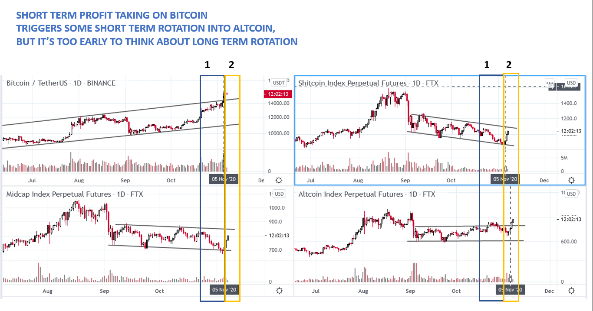
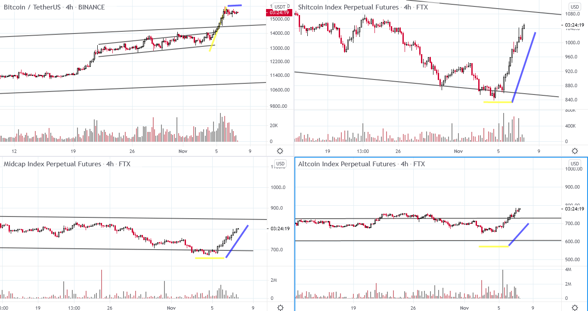

# Wyckoff Crypto Report vol 42

URL: https://www.wyckoffanalytics.com/wyckoff-crypto-report-vol-42/
Date: 2020-11-06T06:34:00
Author: Alessio Rutigliano

The WYCKOFF CRYPTO REPORT provides regular updates on the most popular digital assets based on the Wyckoff Methodology. Our market outlook follows the principles of Supply and Demand and Market Participants Analysis as they are taught and practiced in the WTC/WTPC/WMD classes.
### Wyckoff Crypto Discussion Episode 10
We are excited to launch a new video series totally devoted to crypto-assets, the Wyckoff Crypto Discussion ! Join us each Thursday for a discussion of the cryptocurrency market from a Wyckoff perspective . Submit your questions or your altcoin picks, we will be happy to discuss your charts!
###
### Flash update after Thursday’s WCD

Bitcoin has continued to rally and has reached the 16K level. Some short term profit taking has occurred and the altcoin market has recovered: a short term rotation. We have anticipated this scenario in the last Wyckoff Crypto Discussion : when the market leader (in this case Bitcoin) is in the speculative stage, new market participants want to jump on the bandwagon and generally look for low caps in the oversold area. This dynamic generally occurs in the terminal move of the uptrend.

Even though the rally off the bottom is a good short term opportunity, it’s too early to think about a long term rotation into the altcoin sector. Intraday traders must consider however the “switch” between Bitcoin and altcoin: at this stage of the trend, when Bitcoin is going up, the rest of the market consolidates. When Bitcoin consolidates, the altcoin market goes up. This shift can continue until a significant correction occurs. That correction will be the best spot to pick the outperformers in the altcoin market.
## Trading the Crypto Market with the Wyckoff Method
Investing and trading in the crypto space requires discipline and a systematic approach. The Wyckoff Method provides a logical framework for both long term investors and intraday traders.
In these three sessions, Alessio Rutigliano illustrates how to apply the techniques used by generations of stock and commodities traders to this new emerging asset class. The course covers multiple strategies for several types of traders, from long term investors that want to participate in this new market through conventional ETNs to advanced crypto traders that want to take advantage of the high volatility and momentum of these instruments. The course includes case studies from Bitcoin and Altcoin markets and exercises.
https://www.wyckoffanalytics.com/event/trading-the-crypto-market-with-the-wyckoff-method/

________________________________________________________________________________________
## Send us your question!
Register here for free or comment on the report on our Twitter channel https://twitter.com/WyckoffAnalysis
I will be happy to discuss your questions in the next Crypto Reports!
