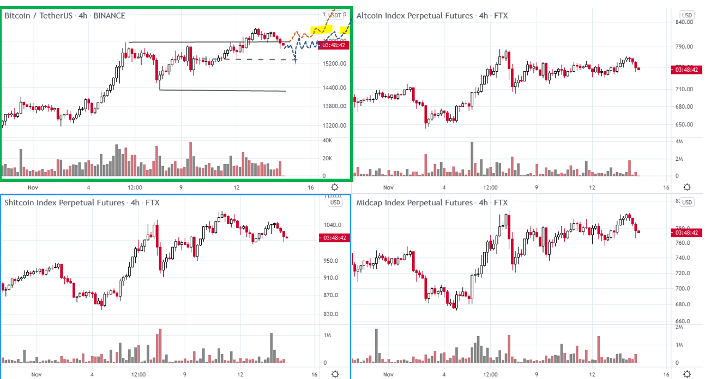
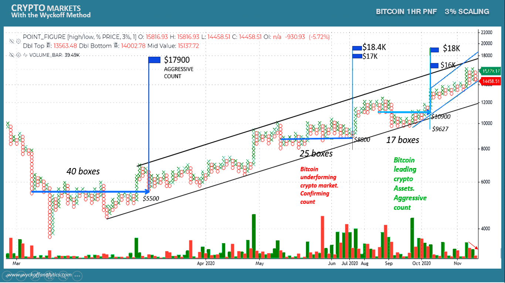

# Wyckoff Crypto Report vol 43

URL: https://www.wyckoffanalytics.com/wyckoff-crypto-report-vol-43/
Date: 2020-11-13T04:53:15
Author: Alessio Rutigliano

The WYCKOFF CRYPTO REPORT provides regular updates on the most popular digital assets based on the Wyckoff Methodology. Our market outlook follows the principles of Supply and Demand and Market Participants Analysis as they are taught and practiced in the WTC/WTPC/WMD classes.
### Wyckoff Crypto Discussion Episode 11
Join us each Thursday for a discussion of the cryptocurrency market from a Wyckoff perspective . Submit your questions or your altcoin picks, we will be happy to discuss your charts!
### Flash update after Thursday’s WCD
Bitcoin continues to lead the market. The current formation has no distributional signs yet and suggests continuation to the upside. PnF counts indicate that there is room to $18K, probably the last speculative part of the rally. We have entered this position around the 10K levels, is it possible to add? Yes. As usual, let’s look for some low-risk point of entry .
SCENARIO 1) If the resistance turns to support ( red dotted line scenario ) we can add to the position on the way up, point of entry #1 highlighted in yellow.
SCENARIO 2) If supply is still present and we need to revisit previous demand levels, look for a spring of the 15.5k level ( blue dotted line ). An entry after the test or on the break out of the resistance would offer us another low-risk point of entry to add to the position.
PATTERN FAILURE: Supply emerges and we need to revisit the support of the trading range at $14300.

###
###
__________________________________________________
### Chart of the Week
Prof. Bruce Fraser has discussed percentage scaling in his fantastic blogs and webinars. The accumulation at the bottom suggests a $17900 target. Two reaccumulation counts confirm the target. We expect a last speculative move to the upside that can potentially overthrow the overbought line of the log channel in late 2020 . This is a short term chart. In the long run, the whole multi-year consolidation for Bitcoin suggests much higher targets in 2021, but the ATH resistance suggests some pause.
We have discussed this chart in the last episode of our Wyckoff Crypto Discussion!

## Trading the Crypto Market with the Wyckoff Method
Investing and trading in the crypto space requires discipline and a systematic approach. The Wyckoff Method provides a logical framework for both long term investors and intraday traders.
In these three sessions, Alessio Rutigliano illustrates how to apply the techniques used by generations of stock and commodities traders to this new emerging asset class. The course covers multiple strategies for several types of traders, from long term investors that want to participate in this new market through conventional ETNs to advanced crypto traders that want to take advantage of the high volatility and momentum of these instruments. The course includes case studies from Bitcoin and Altcoin markets and exercises.
https://www.wyckoffanalytics.com/event/trading-the-crypto-market-with-the-wyckoff-method/

