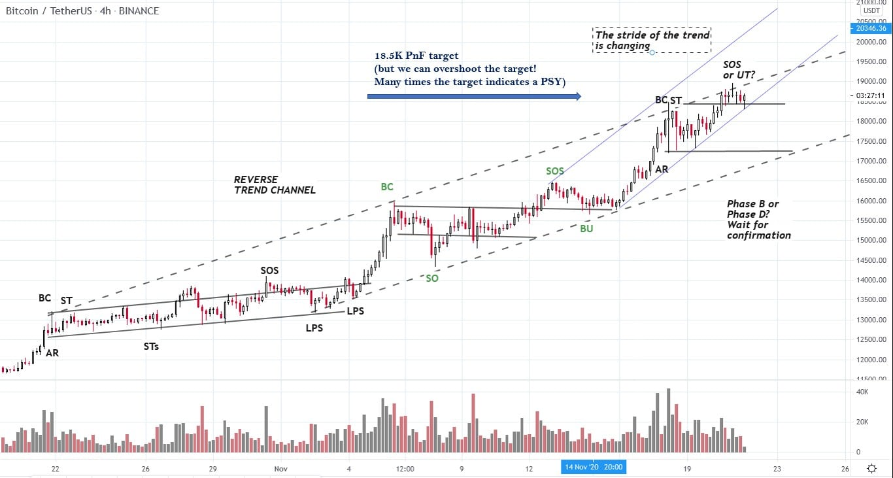

# Wyckoff Crypto Report vol 44

URL: https://www.wyckoffanalytics.com/wyckoff-crypto-report-vol-44/
Date: 2020-11-20T05:18:50
Author: Alessio Rutigliano

The WYCKOFF CRYPTO REPORT provides regular updates on the most popular digital assets based on the Wyckoff Methodology. Our market outlook follows the principles of Supply and Demand and Market Participants Analysis as they are taught and practiced in the WTC/WTPC/WMD classes.
### Wyckoff Crypto Discussion Episode 12
Join us each Thursday for a discussion of the cryptocurrency market from a Wyckoff perspective . Submit your questions or your candidates!
## Flash update on Bitcoin

We have hit the PnF target at 18.5K but we do not see signs of an incoming reversal yet. Supply is coming in, but each time buyers absorb the supply at a higher level. The stride of the trend is accelerating , suggesting another climactic push to the upside that can conclude the whole trend.
TACTICS
Campaigners who have entered this position at much lower prices (10K) can just raise their stop loss by monitoring the daily chart as we have shown in our Wyckoff Crypto Discussion .
Short term traders should consider two scenarios here:
SCENARIO 1 (high prob.) . The current consolidation produces another swing to the upside with increased volume. An upswing with extreme volume could be the final move of the uptrend.
SCENARIO 2 . (low prob) Price fails at the current level and comes back into the trading range. Change of Behavior . It is not unusual to see selling coming in out of sudden on Bitcoin on the weekends, especially on Saturday. The crypto market is generally thin on weekends.
## Trading the Crypto Market with the Wyckoff Method
Investing and trading in the crypto space requires discipline and a systematic approach. The Wyckoff Method provides a logical framework for both long term investors and intraday traders.
In these three sessions, Alessio Rutigliano illustrates how to apply the techniques used by generations of stock and commodities traders to this new emerging asset class. The course covers multiple strategies for several types of traders, from long term investors that want to participate in this new market through conventional ETNs to advanced crypto traders that want to take advantage of the high volatility and momentum of these instruments. The course includes case studies from Bitcoin and Altcoin markets and exercises.
https://www.wyckoffanalytics.com/event/trading-the-crypto-market-with-the-wyckoff-method/

