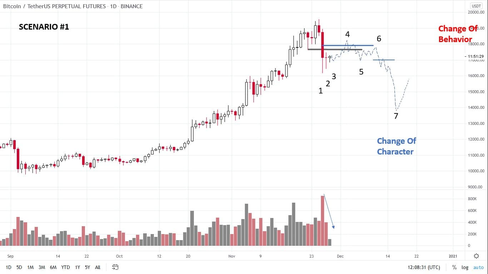
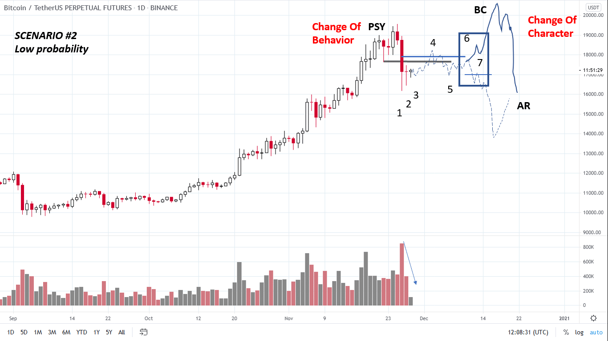

# Wyckoff Crypto Report vol 45

URL: https://www.wyckoffanalytics.com/wyckoff-crypto-report-vol-45/
Date: 2020-11-27T08:01:52
Author: Alessio Rutigliano

The WYCKOFF CRYPTO REPORT provides regular updates on the most popular digital assets based on the Wyckoff Methodology. Our market outlook follows the principles of Supply and Demand and Market Participants Analysis as they are taught and practiced in the WTC/WTPC/WMD classes.
### Wyckoff Crypto Discussion Episode 13 – Q&A
Join us each Thursday for a discussion of the cryptocurrency market from a Wyckoff perspective . Submit your questions or your candidates!
### Bitcoin Flash Update – Tactics!

The big down bar at point [1] is a Change Of Behavior . What do we expect for the next weeks? We must prepare several scenarios and be ready to act on the turning points . The demand tail [1] suggests that some demand is present. Bar [2] and [3] have demand tails too and close in the upper part of the range. Supply is temporarily exhausted, we need to test how much supply is present at higher levels ( blue and black lines). In this scenario, after the first rally [4] , demand deteriorates and we are not able to push above the resistance [6]. A failure at point [ 6] would be an opportunity to short .
### B-plan (low probability)

Traders must always prepare a “B plan”. If demand proves to be still present after the first push to the upside, the short term bearish scenario would be invalidated. What would be the “trigger” for this short-term bullish scenario? HHs-HLs at point [6] and [7] .
____________________________________________________
## Trading the Crypto Market with the Wyckoff Method
Investing and trading in the crypto space requires discipline and a systematic approach. The Wyckoff Method provides a logical framework for both long term investors and intraday traders. In these three sessions, Alessio Rutigliano illustrates how to apply the techniques used by generations of stock and commodities traders to this new emerging asset class. The course covers multiple strategies for several types of traders, from long term investors that want to participate in this new market through conventional ETNs to advanced crypto traders that want to take advantage of the high volatility and momentum of these instruments. The course includes case studies from Bitcoin and Altcoin markets and exercises.
https://www.wyckoffanalytics.com/event/trading-the-crypto-market-with-the-wyckoff-method/

