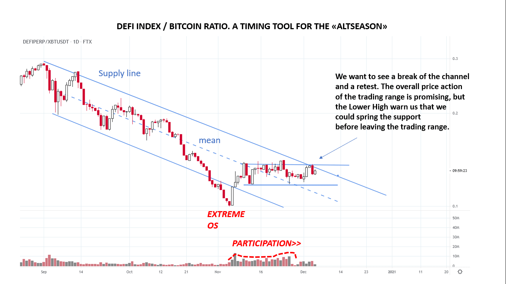

# Wyckoff Crypto Report vol 46

URL: https://www.wyckoffanalytics.com/wyckoff-crypto-report-vol-46/
Date: 2020-12-04T11:02:56
Author: Alessio Rutigliano

The WYCKOFF CRYPTO REPORT provides regular updates on the most popular digital assets based on the Wyckoff Methodology. Our market outlook follows the principles of Supply and Demand and Market Participants Analysis as they are taught and practiced in the WTC/WTPC/WMD classes.
### Wyckoff Crypto Discussion Episode 14
Join us each Thursday for a discussion of the cryptocurrency market from a Wyckoff perspective . Submit your questions or your candidates!
### Flash Update. DeFi / Bitcoin ratio study & Tactics
The big picture that we have discussed in our last Wyckoff Crypto Discussion has not changed yet. In the last session, we have focused on small caps and DeFi assets. The Defi index is in a very interesting position, but the timing for the emergence of the uptrend could be tricky . Altseasons -in the crypto slang, periods in which small caps are leading the market- are extremely profitable, but timing the market requires patience.
Prof. Bruce Fraser applies Wyckoff logic to growth/value ratios and relative strength charts too. Let’s apply the same concepts here. Here we see the Defi / Bitcoin ratio.
The current trading range has bullish characteristics: after a climactic down move, the overall volume during the consolidation has increased while price spends time in the upper part of the trading range.

THE POINT OF DANGER
The last Lower high is warning us that we could revisit the low of the trading range (spring) before breaking the supply line.
WHAT WE WANT TO SEE
A break of supply line followed by a retest would act as a confirmation of the “alt season” .
________________________________________________________________________
## Trading the Crypto Market with the Wyckoff Method
Investing and trading in the crypto space requires discipline and a systematic approach. The Wyckoff Method provides a logical framework for both long term investors and intraday traders. In these three sessions, Alessio Rutigliano illustrates how to apply the techniques used by generations of stock and commodities traders to this new emerging asset class. The course covers multiple strategies for several types of traders, from long term investors that want to participate in this new market through conventional ETNs to advanced crypto traders that want to take advantage of the high volatility and momentum of these instruments. The course includes case studies from Bitcoin and Altcoin markets and exercises.
https://www.wyckoffanalytics.com/event/trading-the-crypto-market-with-the-wyckoff-method/

