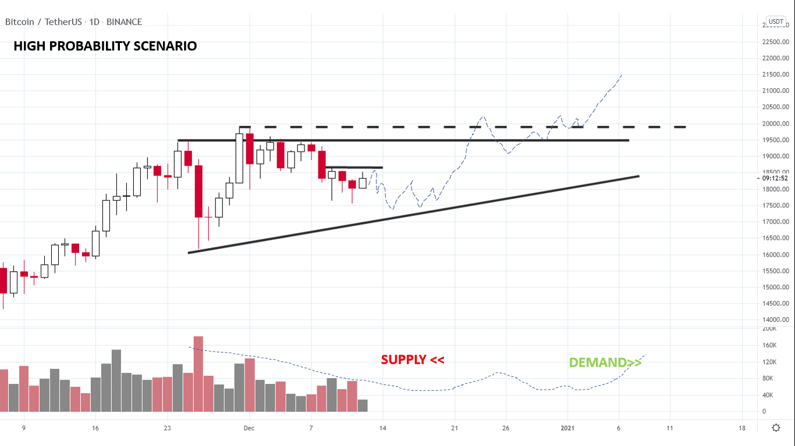
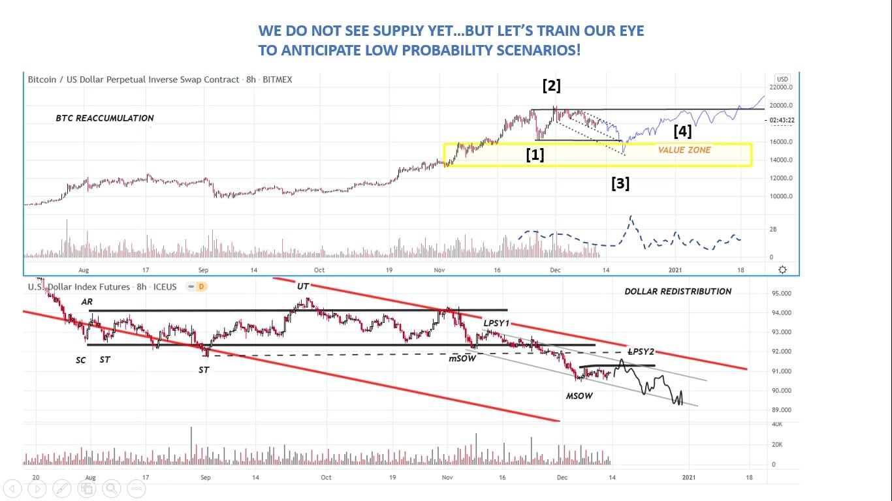

# Wyckoff Crypto Report vol 47

URL: https://www.wyckoffanalytics.com/wyckoff-crypto-report-vol-47/
Date: 2020-12-11T09:20:21
Author: Alessio Rutigliano

The WYCKOFF CRYPTO REPORT provides regular updates on the most popular digital assets based on the Wyckoff Methodology. Our market outlook follows the principles of Supply and Demand and Market Participants Analysis as they are taught and practiced in the WTC/WTPC/WMD classes.
### Wyckoff Crypto Discussion Episode 15
### High probability scenario
Supply has come in on the Change Of Behavior, but it has not produced a significant result to the downside yet. Low supply suggests a bullish texture for the current consolidation.

###
### ___________________________
### What happens if more supply comes in? Here is our alternative scenario
We have discussed the high probability scenarios in our Wyckoff Crypto Discussion. However, it’s good practice for traders to think about low probability scenarios too .
If more supply comes into the market in the next week, the consolidation could have a different shape. It’s not uncommon to see a loss of momentum in speculative instruments followed by a more pronounced reaction. A spring/shakeout in the value zone highlighted in yellow would shake out speculators. Short term weakness in Bitcoin could coincide with a technical rally for the dollar. The big picture would not change for both assets.

________________________
## Trading the Crypto Market with the Wyckoff Method
Investing and trading in the crypto space requires discipline and a systematic approach. The Wyckoff Method provides a logical framework for both long term investors and intraday traders. In these three sessions, Alessio Rutigliano illustrates how to apply the techniques used by generations of stock and commodities traders to this new emerging asset class. The course includes case studies from Bitcoin and Altcoin markets and exercises.
https://www.wyckoffanalytics.com/event/trading-the-crypto-market-with-the-wyckoff-method/

