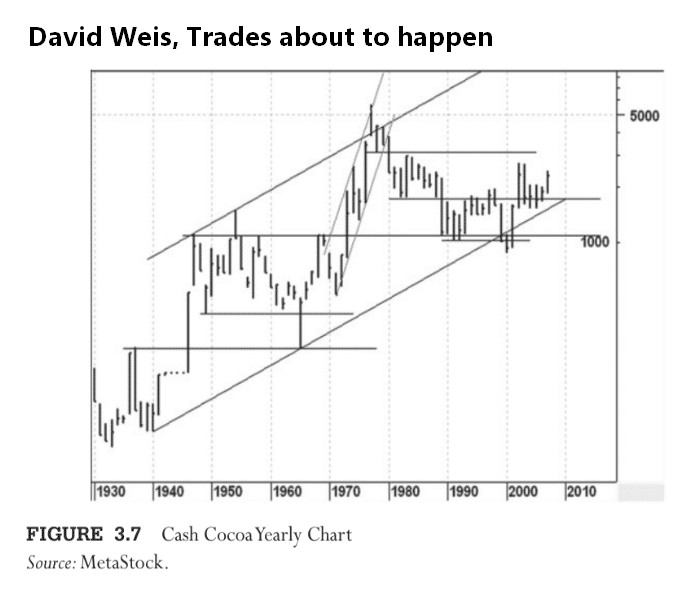
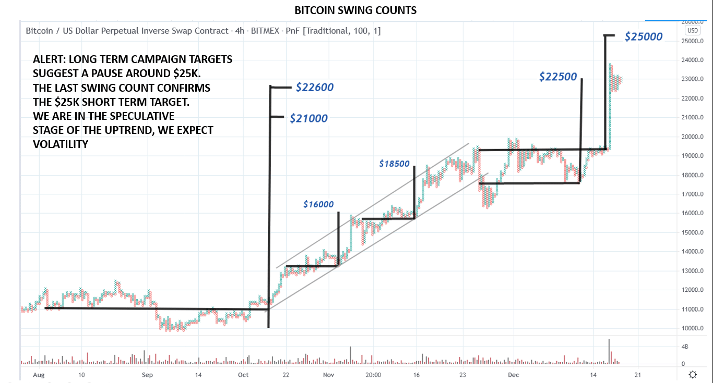

# Wyckoff Crypto Report vol 48

URL: https://www.wyckoffanalytics.com/wyckoff-crypto-report-vol-48/
Date: 2020-12-18T10:22:36
Author: Alessio Rutigliano

The WYCKOFF CRYPTO REPORT provides regular updates on the most popular digital assets based on the Wyckoff Methodology. Our market outlook follows the principles of Supply and Demand and Market Participants Analysis as they are taught and practiced in the WTC/WTPC/WMD classes.
### Wyckoff Crypto Discussion Episode 16
The next two Wyckoff Crypto Discussions (24th and 31st December) will be devoted to your questions. Our weekly market outlook will be back as usual on January 7th.
### In memory of David Weis

Legendary Wyckoffian David Weis has passed. His teaching style was truly unique . David’s work on monthly and yearly charts of commodities has deeply influenced the way we look at cryptocurrencies. Here you can see a chart from his book “Trades about to happen” -a must for Wyckoffians. Yearly timeframe, semilog chart. What do you see here? Multi-decade uptrend channel, trading range, spring. Classic Wyckoff principles at work.
### Your questions
Could you review the PnF count for the bitcoin in the next session? Thanks, Claudio.
Hi Claudio, the Point and Figure chart of the multi-year structure (2018-2020) suggests very high targets (we are talking about six figures). In the long term, crazy targets like $130K are definitely possible. However, the high volatility of Bitcoin forces us to “stalk the uptrend”. Think of this price action: $3K, $18K, $16K, $25K, $16K, $30K, and so on. The occasional crypto investor /holder usually enjoys the rollercoaster. Professional traders instead must pay attention to each swing in order to reduce the volatility of their portfolio and allocate capitals in the most efficient way. This is our mission.
The rules of horizontal counting dictate us to focus first on the most recent segments of the big accumulation structure (2019-2020). Campaign counts suggest a pause in the 23-25K area. We are very close to this target and we are definitely in the speculative stage of the uptrend. We expect volatility in both directions.
Here you can take a look at my intraday swing counts. A recent swing count confirms the $23-25K target. We are cautious here. We will focus on multi-year counts in 2021!

