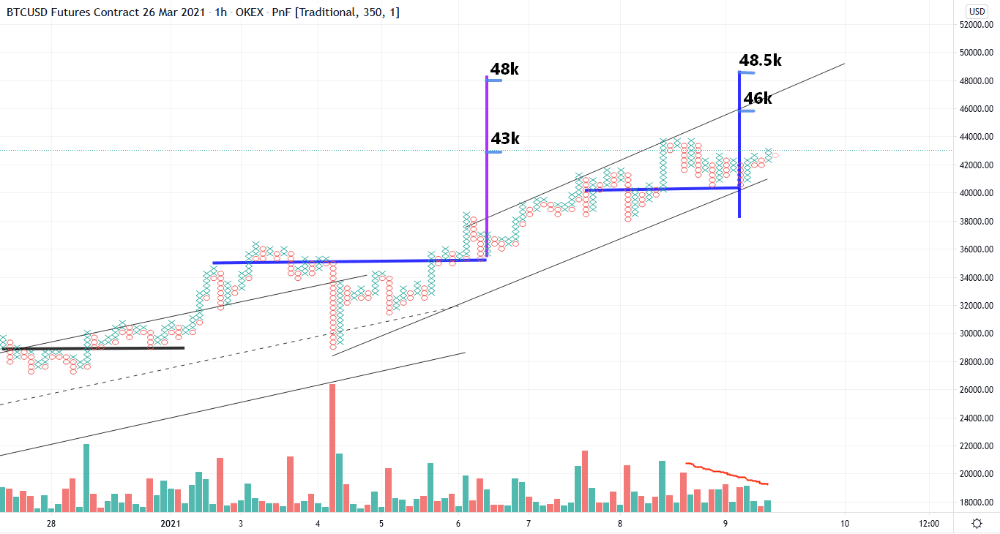
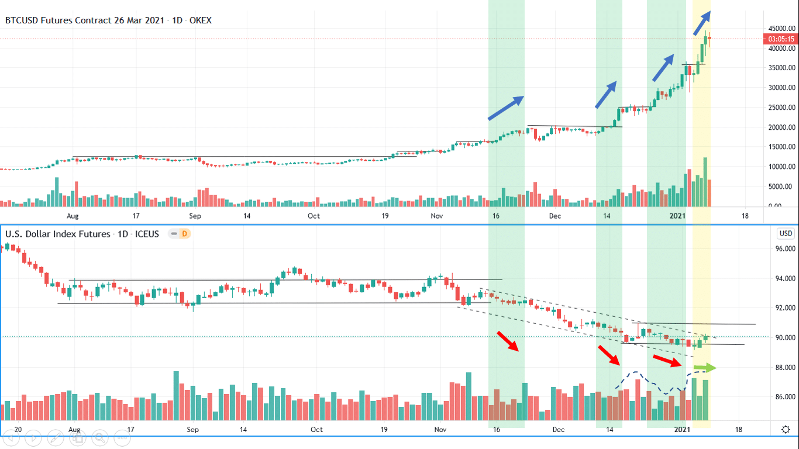

# Wyckoff Crypto Report vol 49

URL: https://www.wyckoffanalytics.com/wyckoff-crypto-report-vol-49/
Date: 2021-01-08T11:57:34
Author: Alessio Rutigliano

The WYCKOFF CRYPTO REPORT provides regular updates on the most popular digital assets based on the Wyckoff Methodology. Our market outlook follows the principles of Supply and Demand and Market Participants Analysis as they are taught and practiced in the WTC/WTPC/WMD classes.
### Wyckoff Crypto Discussion Episode 19
Join us each Thursday for a discussion of the cryptocurrency market from a Wyckoff perspective.
### Flash Update. Target almost reached.
Bitcoin is close to reach the long term targets that we have shown in our Wyckoff Crypto Discussion . This is the time to be very aggressive with our stop loss and protect our gains. Intraday PnF swing counts suggest that we have still some room to the upside . A climactic move could end the uptrend.

### Beware of the Dollar

The chart of the dollar shows that some demand is present. The last reaction has low volume, small spreads and poor result to the downside. Price springs the support and quickly comes back into the range. We do not buy spring in a downtrend, but this price action suggests that the Dollar is in the oversold condition, and in the next weeks we could see an attempt to retest significant resistance levels. A short term rally for the dollar could coincide with a local top for Bitcoin.
