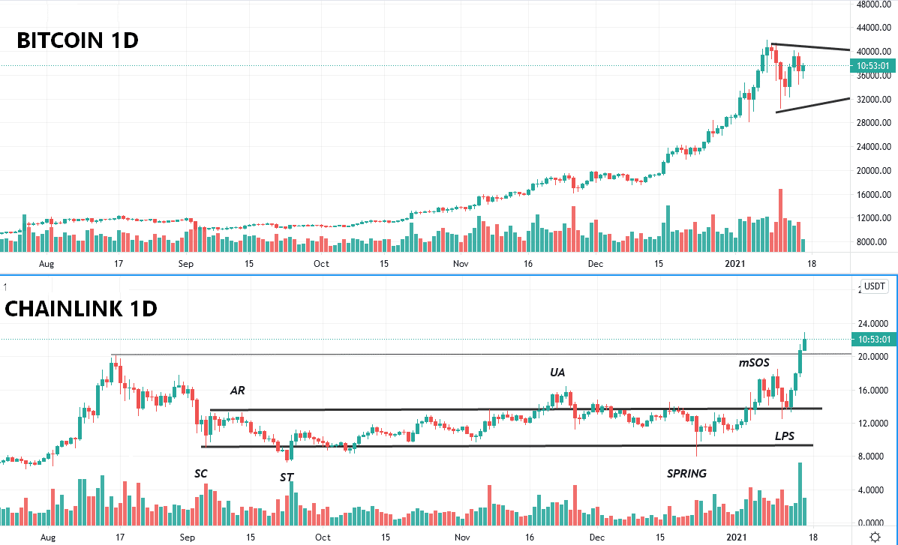
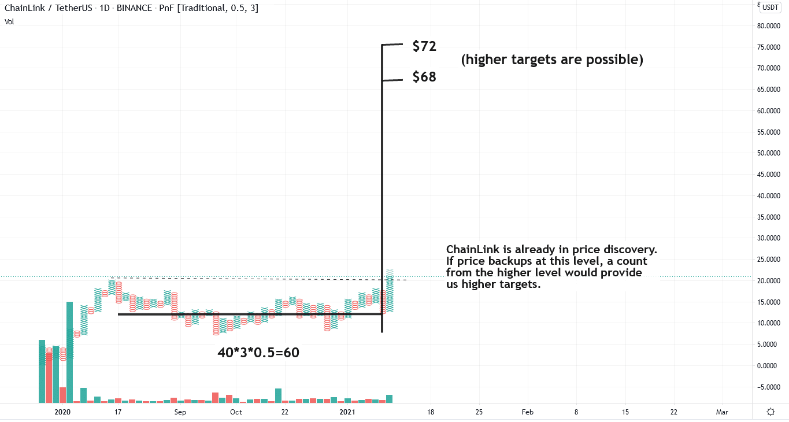

# Wyckoff Crypto Report vol 50

URL: https://www.wyckoffanalytics.com/wyckoff-crypto-report-vol-50/
Date: 2021-01-15T12:41:17
Author: Alessio Rutigliano

The WYCKOFF CRYPTO REPORT provides regular updates on the most popular digital assets based on the Wyckoff Methodology. Our market outlook follows the principles of Supply and Demand and Market Participants Analysis as they are taught and practiced in the WTC/WTPC/WMD classes.
### Wyckoff Crypto Discussion Episode 20
Join us each Thursday for a discussion of the cryptocurrency market from a Wyckoff perspective.
### Flash update: Bitcoin consolidating, rotation in place. ChainLink ATH

Chainlink has completed its reaccumulation accumulation structure. Supply has been absorbed. If the market stays in risk-on mode in the next weeks, the price discovery can continue. Let’s see PnF count is already available for ChainLink. If a short term reaction occurs, a Backup would offer a bigger PnF count and higher objectives.

