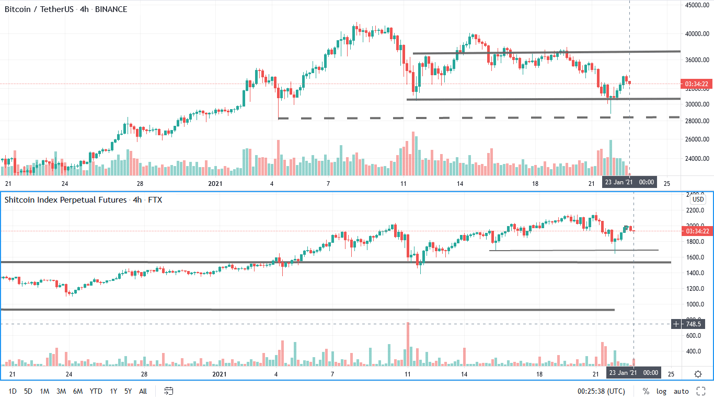
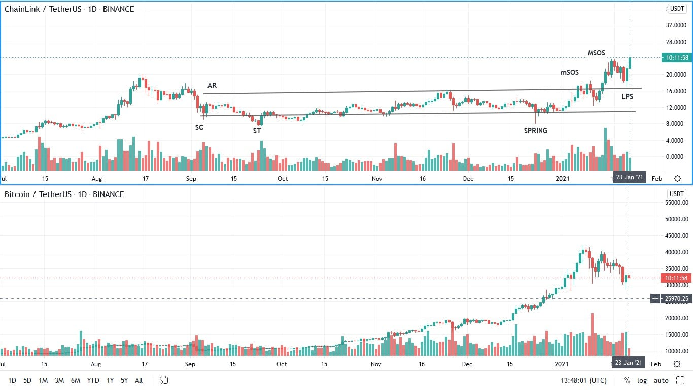
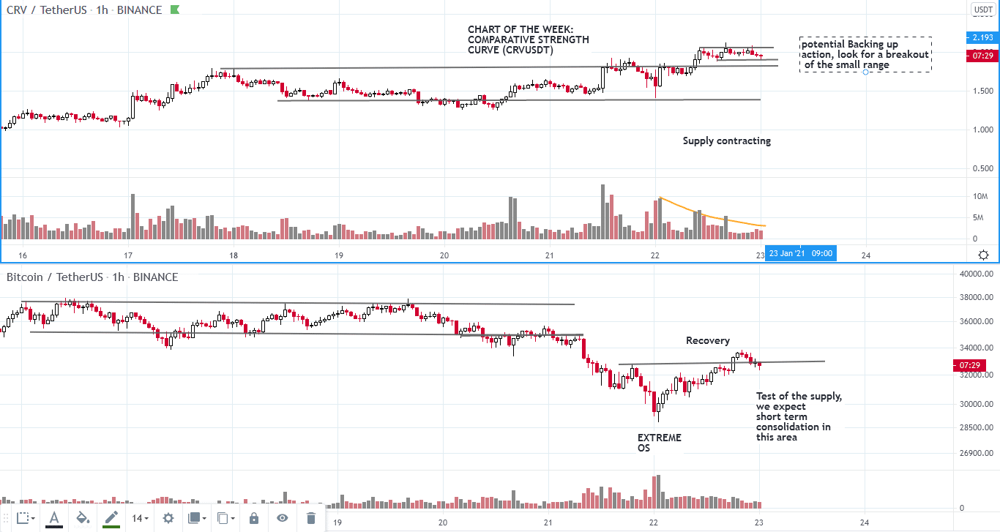

# Wyckoff Crypto Report vol 51

URL: https://www.wyckoffanalytics.com/wyckoff-crypto-report-vol-51/
Date: 2021-01-22T09:28:15
Author: Alessio Rutigliano

The WYCKOFF CRYPTO REPORT provides regular updates on the most popular digital assets based on the Wyckoff Methodology. Our market outlook follows the principles of Supply and Demand and Market Participants Analysis as they are taught and practiced in the WTC/WTPC/WMD classes.
### Wyckoff Crypto Discussion Episode 21
Join us each Thursday for a discussion of the cryptocurrency market from a Wyckoff perspective.
### Flash update: BTC spring, low caps show strength on the reaction
The spring scenario that we have anticipated on Thursday is in play. Demand has emerged on the support levels. High effort to the downside, limited result, followed by upbars with three upbar with good spreads. We are currently testing the supply present on the 32K level. Volume is decreasing, and the overall picture looks constructive in the short term. The selloff has affected the altcoin market too, but altcoins still show comparative strength .

### Chart of the week #1 ChainLink
Chainlink looks very well positioned and ready to start the next bull run. We will follow the uptrend bar by bar in the next weeks.

### Chart of the week #2
CRVUSD shows comparative strength. The supply signature is contracting, a very constructive sign.

