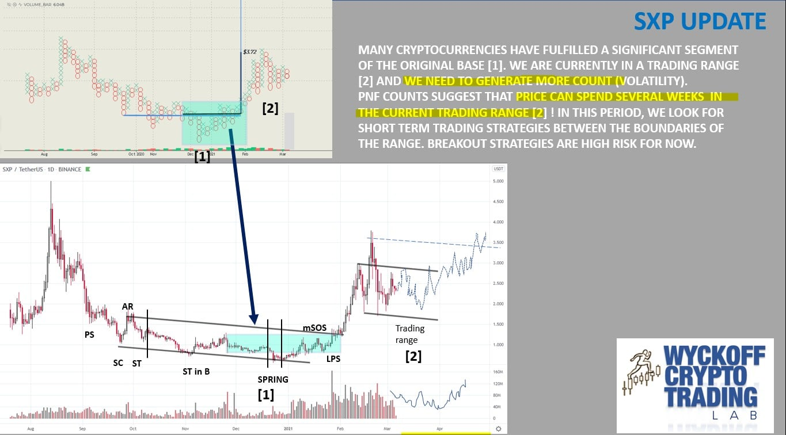

# Wyckoff Crypto Report vol 56

URL: https://www.wyckoffanalytics.com/wyckoff-crypto-report-vol-56/
Date: 2021-03-05T09:59:04
Author: Alessio Rutigliano

The WYCKOFF CRYPTO REPORT provides regular updates on the most popular digital assets based on the Wyckoff Methodology. Our market outlook follows the principles of Supply and Demand and Market Participants Analysis as they are taught and practiced in the WTC/WTPC/WMD classes.
### Wyckoff Crypto Discussion Episode 27
Join us each Thursday for a discussion of the cryptocurrency market from a Wyckoff perspective.
### Weekend Update: The big Trading range

###
### The Wyckoff Crypto Trading Lab is open. Join us on Discord now!!!

